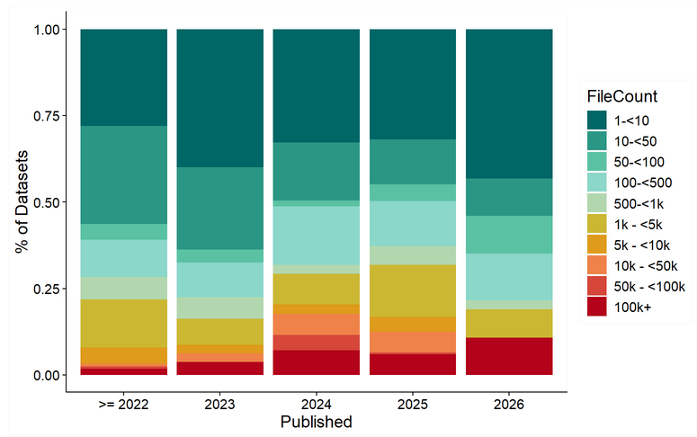
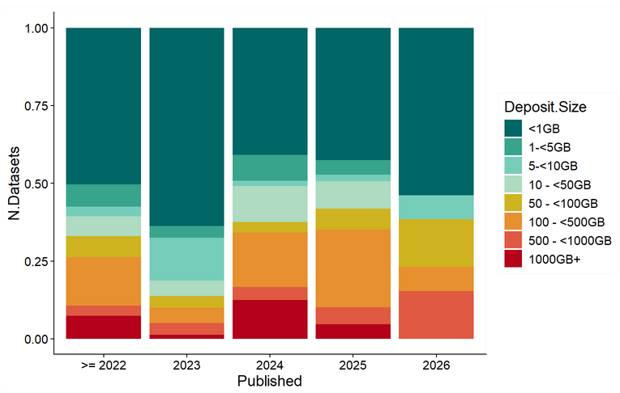
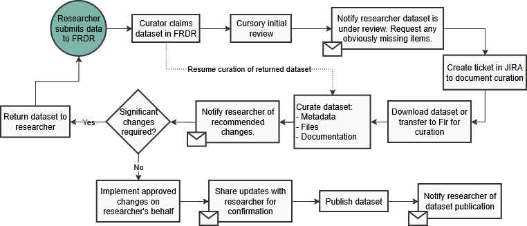
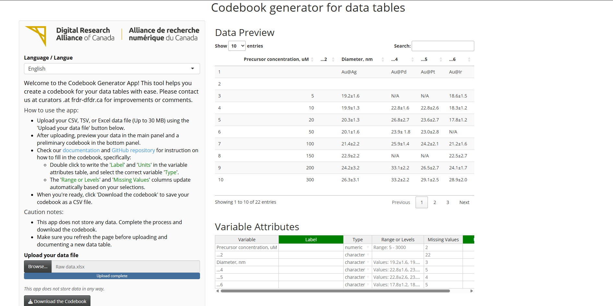

```{r}
#| include: false
library(knitr)

# Helper to find the latest file matching a pattern
get_latest_file <- function(dir, pattern) {
  if (!dir.exists(dir)) return(NULL)
  files <- list.files(dir, pattern = pattern, full.names = TRUE)
  if (length(files) == 0) return(NULL)
  files[which.max(file.info(files)$mtime)]
}
```

```{r}
# Helper function to run scripts safely and capture outputs
run_curation_script <- function(script, input_dir, output_dir = "Results") {
  script_path = file.path("../Scripts", script)
  if (!file.exists(script_path)) {
    return(paste("Error: Script not found at", script_path))
  }
  
  # Ensure the output directory exists
  if (!dir.exists(output_dir)) {
    dir.create(output_dir, recursive = TRUE)
  }
  
  # Standardize path arguments
  input_abs <- normalizePath(input_dir, mustWork = FALSE)
  output_abs <- normalizePath(output_dir, mustWork = FALSE)
  
  # Call Rscript on the script with the folder arguments
  res <- tryCatch({
    out <- system2(
      command = "Rscript", 
      args = c(shQuote(script_path), shQuote(input_abs), shQuote(output_abs)), 
      stdout = TRUE, 
      stderr = TRUE
    )
    # Filter out R package version compilation warnings
    if (length(out) > 0) {
      out <- out[!grepl("was built under R version", out, ignore.case = TRUE)]
      out <- out[!grepl("^Warning messages?:", out, ignore.case = TRUE)]
    }
    paste(out, collapse = "\n")
  }, error = function(e) {
    paste("Execution Error:", e$message)
  })
  
  return(res)
}

# Scan only curation-relevant top-level directories to avoid deep-scanning build/system/notebook folders
root_subdirs <- list.dirs("../", recursive = FALSE)
exclude_root <- "/\\.|^\\.\\./\\.|_book|_freeze|renv|book$|workshop$|_files|Notebook"
clean_root_subdirs <- root_subdirs[!grepl(exclude_root, root_subdirs)]

data_subdirs <- character()
if (dir.exists("../data")) {
  data_subdirs <- list.dirs("../data", recursive = TRUE)
}

all_paths <- unique(c("../", clean_root_subdirs, data_subdirs))
friendly_names <- gsub("^\\.\\./", "", all_paths)
friendly_names[friendly_names == "" | friendly_names == "."] <- "Project Root"
dir_choices <- setNames(all_paths, friendly_names)
```

## Workshop Outline 

::::: columns
::: {.column style="width: 40%; font-size: 0.8em;"}
### 1. Introduction and Context

-   **The Curation Challenge:** Scale and complexity.
-   **The Curation Toolbox:** Structured automation.
-   **Curation Workflows:** Manual vs. automated checks.
:::

::: {.column style="width: 60%; font-size: 0.6em;"}
### 2. Practical Demonstrations

-   **Module 1:** High-Level Profiling (Extensions).
-   **Module 2:** Tabular Quality Control (CSV Check).
-   **Module 3:** Image Quality Control (Metadata and Fixity).
-   **Module 4:** HDF5 Structure and Metadata (Hierarchies).
-   **Module 5:** NetCDF Usability and Conventions (Arrays).
-   **Module 6:** PDF Archival Suitability (Security and Text).
-   **Module 7:** SQLite Database Manifest (Schemas).
-   **Review:** Summaries and collaborative curation.
:::
:::::

------------------------------------------------------------------------

## Context: What is Curation? {.smaller}

::::: columns
::: {.column style="width: 50%; font-size: 0.85em;"}
### Research Data Curation
Data curation is the **ongoing process** of managing research data throughout its lifecycle to make it **FAIR**:

- **F**indable

- **A**ccessible

- **I**nteroperable

- **R**eusable

### Curation vs. Preservation
Curators are not preservationists. We organize, describe, clean, and encourage preservation-friendly formats, but do not perform raw preservation archiving.
:::

::: {.column style="width: 50%; font-size: 0.85em;"}
### Generalist Repositories (FRDR)
The **Federated Research Data Repository ** ([FRDR](https://www.frdr-dfdr.ca/repo/)) is a bilingual platform for sharing and preserving Canadian research data:

- Accepts **well-documented**, **stand-alone** research data.

- Supports medium-to-large sized datasets via [**Globus file transfer**](https://www.globus.org/data-transfer).

- Features geographically distributed storage mirrored across multiple national host sites.
:::
:::::

------------------------------------------------------------------------

## The Scale of Large Datasets {.smaller}

::::: columns
::: {.column style="width: 35%; font-size: 0.8em;"}

### Growing Dataset Scale
Modern curation repositories face exponential growth in both the **number of files** per dataset and the **total storage size**.

- **File Counts:** A single dataset deposit can range from a few files up to **100K+** files.

- **Storage Size:** Dataset storage requirements regularly scale from less than 1 GB up to **1000+ GB**.

- **Format Diversity:** Hundreds of unique extensions dominated by `csv`, `pdf`, `jpg`, and `xlsx`.
:::

::: {.column style="width: 65%; text-align: center; layout-valign = center"}
::: {style="display: flex; gap: 10px; justify-content: center; align-items: center;"}
{style="width: 48%; border: 1px solid #ddd; border-radius: 4px; box-shadow: 0 2px 4px rgba(0,0,0,0.05);"}
{style="width: 48%; border: 1px solid #ddd; border-radius: 4px; box-shadow: 0 2px 4px rgba(0,0,0,0.05);"}
:::
<div style="font-size: 0.6em; margin-top: 10px; color: #555; font-style: italic;">Growth of dataset size and file counts over time (Digital Research Alliance of Canada).</div>
:::
:::::

------------------------------------------------------------------------

## The Data Curation Workflow {.smaller}

::::: columns
::: {.column style="width: 40%; font-size: 0.8em;"}

We utilize the Data Curation Network's **CURATED** steps to ensure datasets meet high standards:

- **C**heck files and metadata.

- **U**nderstand and run files.

- **R**equest missing information.

- **A**ugment metadata.

- **T**ransform file formats.

- **E**valuate FAIRness.

- **D**ocument curation process throughout.
:::

::: {.column style="width: 60%; text-align: center;"}
{fig-alt="Data Curation Workflow Flowchart" style="border: 1px solid #ddd; border-radius: 4px; box-shadow: 0 4px 8px rgba(0,0,0,0.1); width: 100%;"}
<div style="font-size: 0.65em; margin-top: 5px; color: #555; font-style: italic;">FRDR interactive curation pipeline. Working with the researcher is a key aspect of this project</div>
:::
:::::

------------------------------------------------------------------------

## Curation Challenges and Bottlenecks {.smaller}

1. **Dataset Heterogeneity:** Number of files and format variety.

2. **Many Files:** How do you process quickly, securely, and consistently tens of thousands of files?

3. **Large Files:** Raw computing power and specialized memory are required to open, parse, and profile gigabyte-scale files without system crashes.
   
4. **Varying Documentation:** Missing READMEs, orphan numeric statistical variables, and obscure custom scripts.
   
5. **Reproducibility and Security:**Checking code reproducibility, scanning for hardcoded paths, and identifying potential PII (emails/keys) at scale.

------------------------------------------------------------------------

## Research Data Curation Toolbox {.smaller}

::::: columns
::: {.column style="width: 55%; font-size: 0.85em;"}

A collection of R, python and Bash scripts (in development) designed to:

1.  **Profile** directories and extensions automatically.
2.  **Deep-Dive** into tabular and scientific data.
3.  **Verify** code reproducibility and safety.

:::

::: {.column style="width: 45%; text-align: center;"}
{fig-alt="Data Curation Toolbox" style="border: 1px solid #ddd; border-radius: 4px; box-shadow: 0 4px 8px rgba(0,0,0,0.1); max-height: 420px; width: 100%;"}
:::
:::::

::: {.callout-note}
These workflows leverage [Quarto notebooks/books](https://quarto.org/docs/guide/) and automated R scripts to inspect datasets at scale, and generating structured reports.
:::

------------------------------------------------------------------------

# Practical Demonstrations

## Module 1: High-Level Profiling {.smaller}

First-stage triage to understand the scale and composition of incoming datasets.

::::: columns
::: {.column style="width: 50%; font-size: 0.65em;"}
::: {.r-fit-text}
-   **Why:** Manual directory inspection is limited at scale.
-   **Obtained:**
    -   Complete inventory of extensions and sizes.
    -   Deep file metadata (author, dates, MIME types).
    -   Risk flags (empty, system junk, executables).
:::
:::

::: {.column style="width: 50%; font-size: 0.65em;"}
::: {.r-fit-text}
-   **Problems Solved:**
    -   *Extension mismatch:* Finding hidden/falsified formats.
    -   *Security risks:* Flagging unauthorized executables/junk.
    -   *Preservation triage:* Estimating volume and complexity.
:::
:::
-   **Key Tools Used:**
    -   **R (`tidyverse`):** For data sorting and triage.
    -   **`ExifTool` (Perl):** Extracting deep file metadata.
    -   **`exiftoolr`:** R wrapper for ExifTool.

:::::


------------------------------------------------------------------------

::::::: columns
:::: {.column style="width: 60%; font-size: 0.55em;"}
### Core Script Logic

``` r
# Inspect_Extensions_Script.R
# 1. Scans target directory
all_files <- list.files(
  path = target_dir,
  recursive = TRUE,
  full.names = TRUE,
  all.files = TRUE
)

# 2. Generates file inventory
inventory <- tibble(FullPath = all_files) %>%
  mutate(
    FileName = basename(FullPath),
    Extension = tolower(file_ext(FileName)),
    Size_Bytes = file.size(FullPath)
  )

# 3. Applies Risk Flags
junk_patterns <- c("\\.ds_store", "thumbs\\.db")
inventory <- inventory %>%
  mutate(Risk_Flag = case_when(
    Size_Bytes == 0 ~ "Zero-Byte File",
    str_detect(tolower(FileName), junk_patterns) ~ "Junk",
    TRUE ~ "Clean"
  ))
```

::: {style="font-size: 0.75em; margin-top: 10px; font-style: italic; color: #555;"}
*Note: This code block represents the core logic. You can consult the complete [Inspect_Extensions_Script.R](file:///d:/Alliance/RDM/CUR_Res_CurationTools/Scripts/Inspect_Extensions_Script.R) or the interactive [Inspect_Extensions_Notebook.qmd](file:///d:/Alliance/RDM/CUR_Res_CurationTools/Inspect_Extensions_Notebook.qmd) for full deep metadata extraction (ExifTool) and output details.*
:::
::::

:::: {.column style="width: 40%;"}
::: control-card
<div style="font-size: 0.55em; font-weight: bold; color: #006666; margin-bottom: 8px; font-family: 'Ubuntu';">Execution Parameters</div>
<div style="font-size: 0.45em; margin-bottom: 4px; font-family: 'Montserrat';">
  <strong>Target Directory:</strong> <code>data/</code><br>
  <strong>Script:</strong> <code>Inspect_Extensions_Script.R</code><br>
  <strong>Command:</strong><br>
  <pre style="margin-top: 4px; margin-bottom: 0px; font-size: 0.85em; padding: 4px; background: #32322F; color: #FBFAFA; border-radius: 4px;">Rscript Inspect_Extensions_Script.R data/ Results/</pre>
</div>
:::
::::
:::::::

------------------------------------------------------------------------

### Profile Analysis and Diagnostic

::: {.column style="width: 45%; font-size: 0.55em;"}
```{r}
#| echo: false
#| results: asis

latest_summary_file <- get_latest_file("Results", "^Format_Summary_HPC_.*\\.csv$")
latest_inventory_file <- get_latest_file("Results", "^Full_Inventory_ExifTool_HPC_.*\\.csv$")

df <- if (!is.null(latest_summary_file)) read.csv(latest_summary_file, stringsAsFactors = FALSE) else NULL
inv <- if (!is.null(latest_inventory_file)) read.csv(latest_inventory_file, stringsAsFactors = FALSE) else NULL

if (is.null(df)) {
  cat("<div class='control-card' style='font-size: 0.85em; padding: 12px; margin-top: 15px;'>No data available. Please run the scripts locally first.</div>")
} else {
  total_files <- sum(df$Count)
  junk_files <- sum(df$Count[grepl("Junk", df$Risk_Flag, ignore.case = TRUE)])
  exec_files <- sum(df$Count[grepl("Executable", df$Risk_Flag, ignore.case = TRUE)])
  clean_files <- sum(df$Count[grepl("Clean", df$Risk_Flag, ignore.case = TRUE)])
  zero_files <- sum(df$Count[grepl("Zero", df$Risk_Flag, ignore.case = TRUE)])
  
  total_volume_text <- ""
  integrity_text <- ""
  pii_text <- ""
  
  if (!is.null(inv)) {
    if ("Size_MB" %in% names(inv)) {
      total_volume <- sum(inv$Size_MB, na.rm = TRUE)
      total_volume_text <- paste0("<strong>Total Volume:</strong> ", round(total_volume, 4), " MB<br>")
    }
    if ("Warning" %in% names(inv)) {
      warn_files <- inv[!is.na(inv$Warning) & inv$Warning != "", ]
      warnings_count <- nrow(warn_files)
      if (warnings_count > 0) {
        integrity_text <- paste0("<span style='color: #D6AB00; font-weight: bold;'>⚠️ INTEGRITY WARNING:</span> Found ", warnings_count, " file(s) with corruption/header warnings.<br>")
      }
    }
    if ("Author" %in% names(inv)) {
      author_files <- inv[!is.na(inv$Author) & inv$Author != "", ]
      pii_count <- nrow(author_files)
      if (pii_count > 0) {
        unique_authors <- unique(author_files$Author)
        pii_text <- paste0("<span style='color: #D6AB00; font-weight: bold;'>⚠️ PRIVACY ALERT:</span> Found ", pii_count, " file(s) with Author metadata (potential PII: ", paste(unique_authors, collapse = ", "), ").<br>")
      }
    }
  }
  
  diag_html <- paste0(
    "<div class='control-card' style='font-size: 0.85em; margin-top: 15px;'>",
    "<div style='font-weight: bold; color: #006666; margin-bottom: 8px;'>LIVE DIRECTORY METRICS</div>",
    "<strong>Total Scanned:</strong> ", total_files, " file(s)<br>",
    total_volume_text,
    "<strong>Clean Files:</strong> ", clean_files, "<br>"
  )
  
  if (zero_files > 0) {
    diag_html <- paste0(diag_html, "<span style='color: #D6AB00; font-weight: bold;'>⚠️ WARNING:</span> Found ", zero_files, " empty (zero-byte) file(s).<br>")
  }
  if (exec_files > 0) {
    diag_html <- paste0(diag_html, "<span style='color: #D6AB00; font-weight: bold;'>⚠️ SECURITY RISK:</span> Found ", exec_files, " executable file(s) (potential security preservation risk).<br>")
  }
  if (junk_files > 0) {
    diag_html <- paste0(diag_html, "<span style='color: #006666; font-weight: bold;'>ℹ️ SYSTEM JUNK:</span> Found ", junk_files, " system files (e.g. .DS_Store, Thumbs.db).<br>")
  }
  diag_html <- paste0(diag_html, integrity_text, pii_text)
  if (zero_files == 0 && exec_files == 0 && junk_files == 0 && integrity_text == "" && pii_text == "") {
    diag_html <- paste0(diag_html, "<span style='color: #006666; font-weight: bold;'>✔️ HEALTHY:</span> Directory structure matches preservation standards.<br>")
  }
  diag_html <- paste0(diag_html, "</div>")
  cat(diag_html)
}
```
:::

::: {.table-container}
```{r}
#| echo: false
if (!is.null(inv)) {
  display_df <- inv
  rename_map <- c(
    "FullPath" = "Full Path",
    "FileName" = "File Name",
    "RelativePath" = "Relative Path",
    "Extension" = "Extension",
    "Size_Bytes" = "Size (Bytes)",
    "Size_MB" = "Size (MB)",
    "Risk_Flag" = "Risk Flag",
    "MIMEType" = "MIME Type",
    "FileType" = "File Type",
    "Warning" = "Warning",
    "Author" = "Author"
  )
  names(display_df) <- sapply(names(display_df), function(name) {
    if (name %in% names(rename_map)) rename_map[name] else name
  })
  knitr::kable(display_df, format = "html", table.attr = "class='table table-striped table-hover'")
} else {
  cat("<p style='font-size:0.5em;'>No inventory data available.</p>")
}
```
:::

------------------------------------------------------------------------

## Module 2: Tabular Quality Control {.smaller}

Automated structure and content validation for tabular data files.

::::: columns
::: {.column style="width: 50%; font-size: 0.65em;"}
::: {.r-fit-text}
-   **Why:** Tabular files often suffer from parsing errors, missing data, and PII leaks.
-   **Obtained:**
    -   Validation of character encoding and schema (rows/cols).
    -   Cell completeness percentage across variables.
    -   Duplicate/redundant record counts and email PII risk checks.
:::
:::

::: {.column style="width: 50%; font-size: 0.65em;"}
::: {.r-fit-text}
-   **Problems Solved:**
    -   *Parsing issues:* Spotting encoding or structure corruption.
    -   *Data gaps:* Measuring missing values automatically.
    -   *Privacy risks:* Checking for raw email/contact details.
:::
:::
-   **Key Tools Used:**
    -   **R (`tidyverse`):** Core data ingestion and cleaning framework.
    -   **`readr`:** Fast parsing and auto-encoding detection.
    -   **`skimr`:** Detailed statistical profiling of distributions.

:::::

------------------------------------------------------------------------

:::::: columns
::: {.column style="width: 60%; font-size: 0.55em;"}
### Core Script Logic.

``` r
# Inspect_csv_Script.R
# 1. Scans CSVs and runs a health check
analyze_csv_health <- function(file_path) {
  df <- read_csv(file_path, show_col_types = FALSE)
  n_rows <- nrow(df)
  n_cols <- ncol(df)
  n_missing <- sum(is.na(df))
  
  # 2. Regex Check for Email PII
  email_pattern <- "[a-zA-Z0-9._%+-]+@[a-zA-Z0-9.-]+"
  char_cols <- select(df, where(is.character))
  pii_found <- any(str_detect(char_cols, email_pattern))
  
  tibble(
    FileName = basename(file_path),
    Rows = n_rows,
    Cols = n_cols,
    Pct_Complete = round(100 * (1 - n_missing/n_cells), 2),
    PII_Risk = pii_found
  )
}
```

::: {style="font-size: 0.75em; margin-top: 10px; font-style: italic; color: #555;"}
*Note: This code block represents the core logic. You can consult the complete [Inspect_csv_Script.R](file:///d:/Alliance/RDM/CUR_Res_CurationTools/Scripts/Inspect_csv_Script.R) or the interactive [Inspect_csv_Notebook.qmd](file:///d:/Alliance/RDM/CUR_Res_CurationTools/Inspect_csv_Notebook.qmd) for full encoding, completeness, and detailed column profiling.*
:::
:::

:::: {.column style="width: 40%;"}
::: control-card
<div style="font-size: 0.55em; font-weight: bold; color: #006666; margin-bottom: 8px; font-family: 'Ubuntu';">Execution Parameters</div>
<div style="font-size: 0.45em; margin-bottom: 4px; font-family: 'Montserrat';">
  <strong>Target Directory:</strong> <code>data/</code><br>
  <strong>Script:</strong> <code>Inspect_csv_Script.R</code><br>
  <strong>Command:</strong><br>
  <pre style="margin-top: 4px; margin-bottom: 0px; font-size: 0.85em; padding: 4px; background: #32322F; color: #FBFAFA; border-radius: 4px;">Rscript Inspect_csv_Script.R data/ Results/</pre>
</div>
:::
::::
::::::

------------------------------------------------------------------------

::::: columns
::: {.column style="width: 50%; font-size: 0.60em;"}
### Tabular Analysis and Diagnostic

::: {.r-fit-text}
```{r}
#| echo: false
#| results: asis

latest_csv_file <- get_latest_file("Results", "^CSV_Health_Check.*\\.csv$")
df <- if (!is.null(latest_csv_file)) read.csv(latest_csv_file, stringsAsFactors = FALSE) else NULL

if (is.null(df)) {
  cat("<div class='control-card' style='font-size: 0.85em; padding: 12px; margin-top: 15px;'>No data available. Please run the scripts locally first.</div>")
} else {
  total_files <- nrow(df)
  total_volume <- sum(df$Size_MB, na.rm = TRUE)
  failed_files <- sum(grepl("Read Failed", df$Status, ignore.case = TRUE))
  success_files <- sum(df$Status == "Success", na.rm = TRUE)
  total_duplicates <- sum(df$Duplicate_Rows, na.rm = TRUE)
  pii_files <- sum(df$PII_Risk == TRUE, na.rm = TRUE)
  
  diag_html <- paste0(
    "<div class='control-card' style='font-size: 0.85em; margin-top: 15px;'>",
    "<div style='font-weight: bold; color: #006666; margin-bottom: 8px;'>LIVE TABULAR METRICS</div>",
    "<strong>Total Audited:</strong> ", total_files, " CSV file(s)<br>",
    "<strong>Total Volume:</strong> ", round(total_volume, 4), " MB<br>",
    "<strong>Successfully Parsed:</strong> ", success_files, "<br>"
  )
  if (failed_files > 0) {
    diag_html <- paste0(diag_html, "<span style='color: #D6AB00; font-weight: bold;'>⚠️ INTEGRITY FAILURE:</span> ", failed_files, " file(s) failed to read correctly.<br>")
  }
  if (total_duplicates > 0) {
    diag_html <- paste0(diag_html, "<span style='color: #D6AB00; font-weight: bold;'>⚠️ REDUNDANCY WARNING:</span> Found ", total_duplicates, " duplicate row(s) across files.<br>")
  }
  if (pii_files > 0) {
    diag_html <- paste0(diag_html, "<span style='color: #D6AB00; font-weight: bold;'>⚠️ PRIVACY RISK:</span> ", pii_files, " file(s) flagged for containing potential email PII.<br>")
  }
  if (failed_files == 0 && total_duplicates == 0 && pii_files == 0) {
    diag_html <- paste0(diag_html, "<span style='color: #006666; font-weight: bold;'>✔️ HEALTHY:</span> All CSV files successfully passed structure, redundancy, and privacy audits.<br>")
  }
  diag_html <- paste0(diag_html, "</div>")
  cat(diag_html)
}
```
:::
:::

::: {.column style="width: 50%; font-size: 0.55em;"}
### CSV Health Check Summary

::: {.table-container}
```{r}
#| echo: false
#| results: asis
if (!is.null(df)) {
  display_df <- df
  rename_map <- c(
    "FileName" = "File Name",
    "Size_MB" = "Size (MB)",
    "Encoding" = "Encoding",
    "Rows" = "Rows",
    "Cols" = "Cols",
    "Pct_Complete" = "Complete %",
    "Duplicate_Rows" = "Duplicates",
    "PII_Risk" = "PII Risk",
    "Status" = "Status"
  )
  names(display_df) <- sapply(names(display_df), function(name) {
    if (name %in% names(rename_map)) rename_map[name] else name
  })
  knitr::kable(display_df, format = "html", table.attr = "class='table table-striped table-hover'")
} else {
  cat("<p style='font-size:0.5em;'>No CSV summary data available.</p>")
}
```
:::
:::
:::::

------------------------------------------------------------------------

## Documenting data tables {.smaller}

Standardizing tabular data documentation with the Codebook Generator App.

::::: columns
::: {.column style="width: 45%;"}
::: {.r-fit-text}
::: {.control-card style="margin-bottom: 12px; font-size: 0.85em; padding: 12px;"}
<div style="font-size: 1.05em; font-weight: bold; color: #006666; margin-bottom: 6px; font-family: 'Ubuntu';">Bilingual Documentation</div>

- **Interactive Editing:** Edit labels, types, and units in real-time using `rhandsontable`.
- **Auto-Profiling:** Automatically detects factor levels, missing values, ranges, and types.
- **Bilingual Interface:** Instantly toggle UI between English and French.
:::

::: {.control-card style="font-size: 0.85em; padding: 12px;"}
<div style="font-size: 1.05em; font-weight: bold; color: #006666; margin-bottom: 6px; font-family: 'Ubuntu';">Privacy and Zero-Install</div>

- **Zero-Server:** Powered by Shinylive, compiles and runs entirely in the client's browser.
- **Local Privacy:** Data remains local to the browser. Zero persistence or leakage risk.
- **Form Support:** Seamless CSV, TSV, and XLSX support up to 30 MB.
:::
:::
:::

::: {.column style="width: 55%; text-align: center;"}
{fig-alt="Codebook Generator App" style="border: 1px solid #ddd; border-radius: 4px; box-shadow: 0 4px 8px rgba(0,0,0,0.1); width: 100%; margin-top: 10px;"}

<div style="margin-top: 15px; font-size: 0.8em;">
📦 **Explore the App:** &nbsp; [Interactive Live Demo](https://alliance-rdm-gdr.github.io/RDM_Codebook_App/) &nbsp;|&nbsp; 📖 [GitHub Repository](https://github.com/Alliance-RDM-GDR/RDM_Codebook_App)
</div>
:::
:::::

-------------------------------------------------------------------------

## Module 3: Image Quality Control {.smaller}

Technical validation, fixity check, and metadata extraction for digital image collections.

::::: columns
::: {.column style="width: 50%; font-size: 0.65em;"}
::: {.r-fit-text}
-   **Why:** Images are complex digital objects that can contain hidden metadata (like GPS coordinates) or have corrupt file headers.
-   **Obtained:**
    -   Basic properties (width, height, format, colorspace).
    -   MD5 checksum calculation for fixity and duplicate detection.
    -   Embedded Exif metadata.
:::
:::

::: {.column style="width: 50%; font-size: 0.65em;"}
::: {.r-fit-text}
-   **Problems Solved:**
    -   *Privacy Risks:* Detecting GPS coordinate leaks (potential human subjects/protected species).
    -   *Technical Outliers:* Identifying incorrect colorspaces or dimension outliers.
    -   *Format Obsolescence:* Flagging proprietary raw formats for conversion to preservation-master TIFFs.
:::
:::
-   **Key Tools Used:**
    -   **`magick`:** Validates file headers and basic image geometry.
    -   **`exiftoolr`:** Harvesting camera and GPS metadata.
    -   **`digest`:** MD5 hashing for integrity checks.

:::::

------------------------------------------------------------------------

:::::: columns
::: {.column style="width: 60%; font-size: 0.55em;"}
### Core Script Logic

``` r
# Inspect_Images_Script.R
# 1. Hashing for Fixity
file_inventory <- file_inventory %>%
  mutate(md5_checksum = map_chr(file_path, digest, file = TRUE, algo = "md5"))

# 2. Geometry Validation (magick)
magick_results <- map_dfr(image_files, function(fp) {
  img <- image_read(fp)
  info <- image_info(img)
  tibble(format_magick = info$format, width = info$width, height = info$height)
})

# 3. Apply Curation Flags
curated_data <- full_report %>%
  mutate(
    flag_duplicate = ifelse(is_duplicate, "DUPLICATE", NA),
    flag_privacy_gps = ifelse(!is.na(GPSLatitude), "HAS_GPS_DATA", NA)
  )
```

::: {style="font-size: 0.75em; margin-top: 10px; font-style: italic; color: #555;"}
*Note: This code block represents the core logic. You can consult the complete [Inspect_Images_Script.R](file:///d:/Alliance/RDM/CUR_Res_CurationTools/Scripts/Inspect_Images_Script.R) or the interactive [Inspect_Images_Notebook.qmd](file:///d:/Alliance/RDM/CUR_Res_CurationTools/Inspect_Images_Notebook.qmd) for full properties extraction, flagging, and output details.*
:::
:::

:::: {.column style="width: 40%;"}
::: control-card
<div style="font-size: 0.55em; font-weight: bold; color: #006666; margin-bottom: 8px; font-family: 'Ubuntu';">Execution Parameters</div>
<div style="font-size: 0.45em; margin-bottom: 4px; font-family: 'Montserrat';">
  <strong>Target Directory:</strong> <code>data/</code><br>
  <strong>Script:</strong> <code>Inspect_Images_Script.R</code><br>
  <strong>Command:</strong><br>
  <pre style="margin-top: 4px; margin-bottom: 0px; font-size: 0.85em; padding: 4px; background: #32322F; color: #FBFAFA; border-radius: 4px;">Rscript Inspect_Images_Script.R data/ Results/</pre>
</div>
:::
::::
::::::

------------------------------------------------------------------------

::::: columns
::: {.column style="width: 45%; font-size: 0.55em;"}

### Image Analysis and Diagnostic

```{r}
#| echo: false
#| results: asis

latest_images_file <- get_latest_file("Results/Inspect_Images", "^Curation_Report_Images_.*\\.csv$")
df <- if (!is.null(latest_images_file)) read.csv(latest_images_file, stringsAsFactors = FALSE) else NULL

if (is.null(df)) {
  cat("<div class='control-card' style='font-size: 0.85em; padding: 12px; margin-top: 15px;'>No data available. Please run the scripts locally first.</div>")
} else {
  total_files <- nrow(df)
  corrupt_files <- sum(!is.na(df$flag_corrupt) & df$flag_corrupt != "")
  duplicate_files <- sum(!is.na(df$flag_duplicate) & df$flag_duplicate != "")
  gps_files <- sum(!is.na(df$flag_privacy_gps) & df$flag_privacy_gps != "")
  outlier_files <- sum(!is.na(df$flag_outlier) & df$flag_outlier != "")
  
  diag_html <- paste0(
    "<div class='control-card' style='font-size: 0.85em; margin-top: 15px;'>",
    "<div style='font-weight: bold; color: #006666; margin-bottom: 8px;'>LIVE IMAGE METRICS</div>",
    "<strong>Total Audited:</strong> ", total_files, " file(s)<br>"
  )
  if (corrupt_files > 0) {
    diag_html <- paste0(diag_html, "<span style='color: #D6AB00; font-weight: bold;'>⚠️ CORRUPTION:</span> Found ", corrupt_files, " unreadable image file(s).<br>")
  }
  if (duplicate_files > 0) {
    diag_html <- paste0(diag_html, "<span style='color: #D6AB00; font-weight: bold;'>⚠️ DUPLICATES:</span> Found ", duplicate_files, " duplicate image file(s).<br>")
  }
  if (gps_files > 0) {
    diag_html <- paste0(diag_html, "<span style='color: #D6AB00; font-weight: bold;'>⚠️ PRIVACY RISK:</span> Found ", gps_files, " image(s) with embedded GPS data.<br>")
  }
  if (outlier_files > 0) {
    diag_html <- paste0(diag_html, "<span style='color: #006666; font-weight: bold;'>ℹ️ OUTLIERS:</span> Found ", outlier_files, " image(s) with non-standard dimensions.<br>")
  }
  if (corrupt_files == 0 && duplicate_files == 0 && gps_files == 0 && outlier_files == 0) {
    diag_html <- paste0(diag_html, "<span style='color: #006666; font-weight: bold;'>✔️ HEALTHY:</span> All images parsed successfully and passed all curation audits.<br>")
  }
  diag_html <- paste0(diag_html, "</div>")
  cat(diag_html)
}
```
:::
:::::

::: {.table-container}
```{r}
#| echo: false
if (!is.null(df)) {
  display_df <- df
  rename_map <- c(
    "file_path" = "File Path",
    "filename" = "File Name",
    "md5_checksum" = "MD5 Checksum",
    "format_magick" = "Format",
    "width" = "Width",
    "height" = "Height",
    "colorspace" = "Colorspace",
    "filesize_mb" = "Size (MB)",
    "valid_image" = "Valid Image",
    "Megapixels" = "Megapixels",
    "GPSLatitude" = "GPS Latitude",
    "is_duplicate" = "Is Duplicate",
    "curation_flags" = "Curation Flags",
    "flag_duplicate" = "Flag Duplicate",
    "flag_corrupt" = "Flag Corrupt",
    "flag_privacy_gps" = "Flag GPS",
    "flag_outlier" = "Flag Outlier"
  )
  names(display_df) <- sapply(names(display_df), function(name) {
    if (name %in% names(rename_map)) rename_map[name] else name
  })
  knitr::kable(display_df, format = "html", table.attr = "class='table table-striped table-hover'")
} else {
  cat("<p style='font-size:0.5em;'>No image summary data available.</p>")
}
```
:::

------------------------------------------------------------------------

## Module 4: HDF5 Structure and Metadata {.smaller}

Hierarchical data structure, object mapping, and attribute harvesting for HDF5 files.

::::: columns
::: {.column style="width: 50%; font-size: 0.65em;"}
::: {.r-fit-text}
-   **Why:** HDF5 is a complex binary "black box" containing nested groups and datasets.
-   **Obtained:**
    -   Internal structure map (Groups, Datasets, and Links).
    -   Data type and dimension validation.
    -   Compression filter details (GZIP, SZIP, LZF).
    -   Embedded user-defined metadata attributes.
:::
:::

::: {.column style="width: 50%; font-size: 0.65em;"}
::: {.r-fit-text}
-   **Problems Solved:**
    -   *Proprietary Compression:* Detecting custom/proprietary filters that prevent reading data.
    -   *Broken Dependencies:* Identifying external links pointing to missing target files.
    -   *Missing Documentation:* Auditing whether datasets are self-describing via attributes.
:::
:::
-   **Key Tools Used:**
    -   **`hdf5r`:** Recursive structural inventory and creation property list checks.

:::::

------------------------------------------------------------------------

:::::: columns
::: {.column style="width: 60%; font-size: 0.55em;"}
### Core Script Logic

``` r
# Inspect_hdf5_Script.R
# 1. Open file and list recursively
h5f <- H5File$new(file_path, mode = "r")
contents <- h5f$ls(recursive = TRUE)

# 2. Extract properties & compression
dcpl <- dset$create_plist
n_filters <- dcpl$get_nfilters()
filters <- map_chr(0:(n_filters - 1), ~ dcpl$get_filter(.x)$name)

# 3. Detect External Link Risk
if (link_type == "H5L_TYPE_EXTERNAL") {
  # Flag external dependency risk
}
```

::: {style="font-size: 0.75em; margin-top: 10px; font-style: italic; color: #555;"}
*Note: This code block represents the core logic. You can consult the complete [Inspect_hdf5_Script.R](file:///d:/Alliance/RDM/CUR_Res_CurationTools/Scripts/Inspect_hdf5_Script.R) or the interactive [Inspect_hdf5_Notebook.qmd](file:///d:/Alliance/RDM/CUR_Res_CurationTools/Inspect_hdf5_Notebook.qmd) for full mapping and attribute audits.*
:::
:::

:::: {.column style="width: 40%;"}
::: control-card
<div style="font-size: 0.55em; font-weight: bold; color: #006666; margin-bottom: 8px; font-family: 'Ubuntu';">Execution Parameters</div>
<div style="font-size: 0.45em; margin-bottom: 4px; font-family: 'Montserrat';">
  <strong>Target Directory:</strong> <code>data/Inspect_hdf5/</code><br>
  <strong>Script:</strong> <code>Inspect_hdf5_Script.R</code><br>
  <strong>Command:</strong><br>
  <pre style="margin-top: 4px; margin-bottom: 0px; font-size: 0.85em; padding: 4px; background: #32322F; color: #FBFAFA; border-radius: 4px;">Rscript Inspect_hdf5_Script.R data/Inspect_hdf5/ Results/</pre>
</div>
:::
::::
::::::

------------------------------------------------------------------------

::::: columns
::: {.column style="width: 45%; font-size: 0.55em;"}
### HDF5 Analysis and Diagnostic
```{r}
#| echo: false
#| results: asis

latest_hdf5_file <- get_latest_file("Results", "^HDF5_Structure_HPC_.*\\.csv$")
df <- if (!is.null(latest_hdf5_file)) read.csv(latest_hdf5_file, stringsAsFactors = FALSE) else NULL

if (is.null(df)) {
  cat("<div class='control-card' style='font-size: 0.85em; padding: 12px; margin-top: 15px;'>No data available. Please run the scripts locally first.</div>")
} else {
  total_objects <- nrow(df)
  datasets <- sum(df$Type == "H5I_DATASET", na.rm = TRUE)
  groups <- sum(df$Type == "H5I_GROUP", na.rm = TRUE)
  errors <- sum(df$Type == "ERROR" | grepl("Failed", df$Status), na.rm = TRUE)
  szip_count <- sum(grepl("szip", df$Compression, ignore.case = TRUE))
  lzf_count <- sum(grepl("lzf", df$Compression, ignore.case = TRUE))
  ext_links <- sum(df$Type == "EXTERNAL_LINK", na.rm = TRUE)
  
  diag_html <- paste0(
    "<div class='control-card' style='font-size: 0.85em; margin-top: 15px;'>",
    "<div style='font-weight: bold; color: #006666; margin-bottom: 8px;'>LIVE HDF5 METRICS</div>",
    "<strong>Total Objects:</strong> ", total_objects, " (", datasets, " datasets, ", groups, " groups)<br>"
  )
  if (errors > 0) {
    diag_html <- paste0(diag_html, "<span style='color: #D6AB00; font-weight: bold;'>⚠️ ERRORES:</span> Found ", errors, " files that failed reading.<br>")
  }
  if (szip_count > 0 || lzf_count > 0) {
    diag_html <- paste0(diag_html, "<span style='color: #D6AB00; font-weight: bold;'>⚠️ PROPRIETARY COMPRESSION:</span> Detected non-standard compression (SZIP/LZF) in ", szip_count + lzf_count, " dataset(s). GZIP is preferred.<br>")
  }
  if (ext_links > 0) {
    diag_html <- paste0(diag_html, "<span style='color: #D6AB00; font-weight: bold;'>⚠️ EXTERNAL LINKS:</span> Found ", ext_links, " external dependencies.<br>")
  }
  if (errors == 0 && szip_count == 0 && lzf_count == 0 && ext_links == 0) {
    diag_html <- paste0(diag_html, "<span style='color: #006666; font-weight: bold;'>✔️ HEALTHY:</span> All HDF5 hierarchies parsed successfully. No external link dependencies or risky custom compression filters detected.<br>")
  }
  diag_html <- paste0(diag_html, "</div>")
  cat(diag_html)
}
```
:::
:::::

::: {.table-container}
```{r}
#| echo: false
if (!is.null(df)) {
  display_df <- df
  rename_map <- c(
    "FileName" = "File Name",
    "Path" = "Object Path",
    "Type" = "Object Type",
    "Dimensions" = "Dimensions",
    "DataType" = "Data Type",
    "Compression" = "Compression",
    "Attributes" = "Attributes",
    "Status" = "Status"
  )
  names(display_df) <- sapply(names(display_df), function(name) {
    if (name %in% names(rename_map)) rename_map[name] else name
  })
  knitr::kable(display_df, format = "html", table.attr = "class='table table-striped table-hover'")
} else {
  cat("<p style='font-size:0.5em;'>No HDF5 structure data available.</p>")
}
```
:::

------------------------------------------------------------------------

## Module 5: NetCDF Usability and Conventions {.smaller}

Multidimensional array validation, Climate and Forecast (CF) metadata compliance, and coordinate checks for NetCDF files.

::::: columns
::: {.column style="width: 50%; font-size: 0.65em;"}
::: {.r-fit-text}
-   **Why:** NetCDF stores spatial grid arrays. Without metadata conventions, data variable dimensions and physical units cannot be parsed.
-   **Obtained:**
    -   Spatial reference check (Coordinate Reference System / grid mapping).
    -   Compliance with Climate and Forecast (CF) metadata conventions.
    -   Data sparsity evaluation (detecting empty array variables).
:::
:::

::: {.column style="width: 50%; font-size: 0.65em;"}
::: {.r-fit-text}
-   **Problems Solved:**
    -   *Non-compliance:* Identifying files lacking standard `Conventions` or global attributes.
    -   *Sparsity:* Flagging empty datasets (e.g., arrays containing 100% NaNs).
    -   *Georeferencing gaps:* Detecting missing CRS parameters which prevent GIS mapping.

-   **Key Tools Used:**
    -   **`tidync`:** Tidy multidimensional array extraction and slicing.
    -   **`ncmeta`:** Fast attribute and schema auditing.
:::
:::

:::::

------------------------------------------------------------------------

:::::: columns
::: {.column style="width: 60%; font-size: 0.55em;"}
### Core Script Logic

``` r
# Inspect_nc_Script.R
# 1. Scan coordinates & dimensions
dims <- tnc %>% hyper_dims()
has_lat <- any(str_detect(dims$name, "(?i)lat|y"))

# 2. Check Conventions and CRS
all_atts <- ncmeta::nc_atts(fp)
has_grid_mapping <- any(all_atts$name == "grid_mapping")

# 3. Sparsity Audit
sample_data <- tnc %>% activate(first_var) %>% hyper_slice()
if (all(is.na(sample_data))) {
  # Flag empty dataset warning
}
```

::: {style="font-size: 0.75em; margin-top: 10px; font-style: italic; color: #555;"}
*Note: This code block represents the core logic. You can consult the complete [Inspect_nc_Script.R](file:///d:/Alliance/RDM/CUR_Res_CurationTools/Scripts/Inspect_nc_Script.R) or the interactive [Inspect_nc_Notebook.qmd](file:///d:/Alliance/RDM/CUR_Res_CurationTools/Inspect_nc_Notebook.qmd) for full attributes extraction and usability reports.*
:::
:::

:::: {.column style="width: 40%;"}
::: control-card
<div style="font-size: 0.55em; font-weight: bold; color: #006666; margin-bottom: 8px; font-family: 'Ubuntu';">Execution Parameters</div>
<div style="font-size: 0.45em; margin-bottom: 4px; font-family: 'Montserrat';">
  <strong>Target Directory:</strong> <code>data/Inspect_nc/</code><br>
  <strong>Script:</strong> <code>Inspect_nc_Script.R</code><br>
  <strong>Command:</strong><br>
  <pre style="margin-top: 4px; margin-bottom: 0px; font-size: 0.85em; padding: 4px; background: #32322F; color: #FBFAFA; border-radius: 4px;">Rscript Inspect_nc_Script.R data/Inspect_nc/ Results/</pre>
</div>
:::
::::
::::::

------------------------------------------------------------------------

::::: columns
::: {.column style="width: 45%; font-size: 0.55em;"}
### NetCDF Analysis and Diagnostic
```{r}
#| echo: false
#| results: asis

latest_nc_file <- get_latest_file("Results/Inspect_nc", "^NetCDF_Inventory_.*\\.csv$")
df <- if (!is.null(latest_nc_file)) read.csv(latest_nc_file, stringsAsFactors = FALSE) else NULL

if (is.null(df)) {
  cat("<div class='control-card' style='font-size: 0.85em; padding: 12px; margin-top: 15px;'>No data available. Please run the scripts locally first.</div>")
} else {
  total_files <- nrow(df)
  corrupt_files <- sum(df$Status == "Corrupt/Unreadable", na.rm = TRUE)
  no_crs <- sum(df$HasCRS == "No Spatial Grid", na.rm = TRUE)
  empty_files <- sum(grepl("Empty", df$DataHealth), na.rm = TRUE)
  
  diag_html <- paste0(
    "<div class='control-card' style='font-size: 0.85em; margin-top: 15px;'>",
    "<div style='font-weight: bold; color: #006666; margin-bottom: 8px;'>LIVE NETCDF METRICS</div>",
    "<strong>Total Audited:</strong> ", total_files, " file(s)<br>"
  )
  if (corrupt_files > 0) {
    diag_html <- paste0(diag_html, "<span style='color: #D6AB00; font-weight: bold;'>⚠️ CORRUPT:</span> Found ", corrupt_files, " unreadable NetCDF file(s).<br>")
  }
  if (no_crs > 0) {
    diag_html <- paste0(diag_html, "<span style='color: #D6AB00; font-weight: bold;'>⚠️ GEOREFERENCING RISK:</span> Found ", no_crs, " file(s) with no spatial CRS mapping.<br>")
  }
  if (empty_files > 0) {
    diag_html <- paste0(diag_html, "<span style='color: #D6AB00; font-weight: bold;'>⚠️ EMPTY ARRAYS:</span> Found ", empty_files, " file(s) containing 100% NaNs.<br>")
  }
  if (corrupt_files == 0 && no_crs == 0 && empty_files == 0) {
    diag_html <- paste0(diag_html, "<span style='color: #006666; font-weight: bold;'>✔️ HEALTHY:</span> All NetCDF files are georeferenced, valid, and contain non-empty data arrays.<br>")
  }
  diag_html <- paste0(diag_html, "</div>")
  cat(diag_html)
}
```
:::
:::::

::: {.table-container}
```{r}
#| echo: false
if (!is.null(df)) {
  display_df <- df
  rename_map <- c(
    "FileName" = "File Name",
    "Status" = "Status",
    "DimsSummary" = "Dimensions Summary",
    "VarCount" = "Variables",
    "HasCRS" = "Has CRS",
    "DataHealth" = "Data Health"
  )
  names(display_df) <- sapply(names(display_df), function(name) {
    if (name %in% names(rename_map)) rename_map[name] else name
  })
  knitr::kable(display_df, format = "html", table.attr = "class='table table-striped table-hover'")
} else {
  cat("<p style='font-size:0.5em;'>No NetCDF inventory data available.</p>")
}
```
:::

------------------------------------------------------------------------

## Module 6: PDF Archival Suitability {.smaller}

Encryption scanning, OCR text accessibility evaluation, and embedded font audits for fixed-layout documents.

::::: columns
::: {.column style="width: 50%; font-size: 0.65em;"}
-   **Why:** PDFs are standard for documentation but can contain image-only scans that block screen readers, or use encryption that prevents archival migration.
-   **Obtained:**
    -   Security status (checking for encryption/password blocks).
    -   Accessibility status (verifying searchable text vs. image-only scans).
    -   Page counts and creation metadata (author, title, creator).
    -   Embedded fonts audit to prevent rendering breakdowns.
:::

::: {.column style="width: 50%; font-size: 0.65em;"}
-   **Problems Solved:**
    -   *Encryption locks:* Identifying encrypted PDFs that block indexing or preservation.
    -   *Image-Only scans:* Detecting documents lacking a text layer (accessible OCR needed).
    -   *Missing metadata:* Finding documents with generic or missing author/title info.
:::
-   **Key Tools Used:**
    -   **`pdftools`:** Direct rendering and metadata extraction of PDF streams.
:::::

------------------------------------------------------------------------

:::::: columns
::: {.column style="width: 60%; font-size: 0.55em;"}
### Core Script Logic

``` r
# Inspect_PDF_Script.R
# 1. Check metadata and security
info <- pdftools::pdf_info(file_path)
is_encrypted <- isTRUE(info$encrypted)

# 2. Extract text and check accessibility
first_page_text <- pdftools::pdf_text(file_path)[1]
char_count <- nchar(trimws(first_page_text))
has_text <- char_count > 10 # Searchable check

# 3. Check embedded fonts
fonts <- pdftools::pdf_fonts(file_path)
```

::: {style="font-size: 0.75em; margin-top: 10px; font-style: italic; color: #555;"}
*Note: This code block represents the core logic. You can consult the complete [Inspect_PDF_Script.R](file:///d:/Alliance/RDM/CUR_Res_CurationTools/Scripts/Inspect_PDF_Script.R) or the interactive [Inspect_PDF_Notebook.qmd](file:///d:/Alliance/RDM/CUR_Res_CurationTools/Inspect_PDF_Notebook.qmd) for full metadata and security audits.*
:::
:::

:::: {.column style="width: 40%;"}
::: control-card
<div style="font-size: 0.55em; font-weight: bold; color: #006666; margin-bottom: 8px; font-family: 'Ubuntu';">Execution Parameters</div>
<div style="font-size: 0.45em; margin-bottom: 4px; font-family: 'Montserrat';">
  <strong>Target Directory:</strong> <code>data/Inspect_pdf/</code><br>
  <strong>Script:</strong> <code>Inspect_PDF_Script.R</code><br>
  <strong>Command:</strong><br>
  <pre style="margin-top: 4px; margin-bottom: 0px; font-size: 0.85em; padding: 4px; background: #32322F; color: #FBFAFA; border-radius: 4px;">Rscript Inspect_PDF_Script.R data/Inspect_pdf/ Results/</pre>
</div>
:::
::::
::::::

------------------------------------------------------------------------

::::: columns
::: {.column style="width: 45%; font-size: 0.55em;"}
### PDF Analysis and Diagnostic
```{r}
#| echo: false
#| results: asis

latest_pdf_file <- get_latest_file("Results/Inspect_pdf", "^PDF_Report_.*\\.csv$")
df <- if (!is.null(latest_pdf_file)) read.csv(latest_pdf_file, stringsAsFactors = FALSE) else NULL

if (is.null(df)) {
  cat("<div class='control-card' style='font-size: 0.85em; padding: 12px; margin-top: 15px;'>No data available. Please run the scripts locally first.</div>")
} else {
  total_files <- nrow(df)
  encrypted_files <- sum(df$Encrypted == TRUE, na.rm = TRUE)
  non_searchable <- sum(df$HasText == FALSE, na.rm = TRUE)
  errors <- sum(grepl("Failed", df$Status), na.rm = TRUE)
  
  diag_html <- paste0(
    "<div class='control-card' style='font-size: 0.85em; margin-top: 15px;'>",
    "<div style='font-weight: bold; color: #006666; margin-bottom: 8px;'>LIVE PDF METRICS</div>",
    "<strong>Total Audited:</strong> ", total_files, " file(s)<br>"
  )
  if (errors > 0) {
    diag_html <- paste0(diag_html, "<span style='color: #D6AB00; font-weight: bold;'>⚠️ ERRORES:</span> Found ", errors, " files that failed parsing.<br>")
  }
  if (encrypted_files > 0) {
    diag_html <- paste0(diag_html, "<span style='color: #D6AB00; font-weight: bold;'>⚠️ SECURITY BLOCK:</span> Found ", encrypted_files, " encrypted PDF(s). Password removal required.<br>")
  }
  if (non_searchable > 0) {
    diag_html <- paste0(diag_html, "<span style='color: #D6AB00; font-weight: bold;'>⚠️ ACCESSIBILITY RISK:</span> Found ", non_searchable, " image-only PDF(s) (OCR text layer missing).<br>")
  }
  if (errors == 0 && encrypted_files == 0 && non_searchable == 0) {
    diag_html <- paste0(diag_html, "<span style='color: #006666; font-weight: bold;'>✔️ HEALTHY:</span> All audited PDF documents are unencrypted, searchable, and fully accessible.<br>")
  }
  diag_html <- paste0(diag_html, "</div>")
  cat(diag_html)
}
```
:::
:::::

::: {.table-container}
```{r}
#| echo: false
if (!is.null(df)) {
  display_df <- df
  rename_map <- c(
    "FileName" = "File Name",
    "Pages" = "Pages",
    "Encrypted" = "Encrypted",
    "Author" = "Author",
    "Title" = "Title",
    "Creator" = "Creator",
    "Created" = "Created Date",
    "HasText" = "Searchable Text",
    "FirstPageChars" = "Page 1 Chars",
    "Fonts" = "Embedded Fonts",
    "Status" = "Status"
  )
  names(display_df) <- sapply(names(display_df), function(name) {
    if (name %in% names(rename_map)) rename_map[name] else name
  })
  knitr::kable(display_df, format = "html", table.attr = "class='table table-striped table-hover'")
} else {
  cat("<p style='font-size:0.5em;'>No PDF summary data available.</p>")
}
```
:::

------------------------------------------------------------------------

## Module 7: SQLite Database Manifest {.smaller}

Relational database manifest extraction, table schemas, and row count tracking for self-contained SQLite files.

::::: columns
::: {.column style="width: 50%; font-size: 0.65em;"}
-   **Why:** SQLite is a highly stable, LoC-preferred format for datasets. However, databases are opaque files; mapping tables and schemas is required to document relational dependencies.
-   **Obtained:**
    -   Complete inventory of database tables.
    -   Table column definitions (schema names).
    -   Database sizes and table row counts.
    -   Status check (empty, failed connection, or successful validation).
:::

::: {.column style="width: 50%; font-size: 0.65em;"}
-   **Problems Solved:**
    -   *Opaque database files:* Documenting the hidden table structures inside a single `.db`/`.sqlite` file.
    -   *Relational disconnect:* Unboxing the database schema to ensure relationships remain clear.
    -   *Empty/Corrupted files:* Flagging tables without rows or databases that fail connections.
:::
-   **Key Tools Used:**
    -   **`RSQLite` and `DBI`:** Connects directly to SQLite containers without server dependencies.

:::::

------------------------------------------------------------------------

:::::: columns
::: {.column style="width: 60%; font-size: 0.55em;"}
### Core Script Logic

``` r
# Inspect_sqlite_Script.R
# 1. Connect and list tables
con <- dbConnect(SQLite(), file_path)
tables <- dbListTables(con)

# 2. Extract column schemas and row counts
map_dfr(tables, function(tbl) {
  cols <- dbGetQuery(con, paste0("PRAGMA table_info(", tbl, ")"))
  row_count <- dbGetQuery(con, paste0("SELECT COUNT(*) as count FROM ", tbl))
  # Map schema names and rows
})
```

::: {style="font-size: 0.75em; margin-top: 10px; font-style: italic; color: #555;"}
*Note: This code block represents the core logic. You can consult the complete [Inspect_sqlite_Script.R](file:///d:/Alliance/RDM/CUR_Res_CurationTools/Scripts/Inspect_sqlite_Script.R) or the interactive [Inspect_sqlite_Notebook.qmd](file:///d:/Alliance/RDM/CUR_Res_CurationTools/Inspect_sqlite_Notebook.qmd) for full relational maps and manifests.*
:::
:::

:::: {.column style="width: 40%;"}
::: control-card
<div style="font-size: 0.55em; font-weight: bold; color: #006666; margin-bottom: 8px; font-family: 'Ubuntu';">Execution Parameters</div>
<div style="font-size: 0.45em; margin-bottom: 4px; font-family: 'Montserrat';">
  <strong>Target Directory:</strong> <code>data/Inspect_sqlite/</code><br>
  <strong>Script:</strong> <code>Inspect_sqlite_Script.R</code><br>
  <strong>Command:</strong><br>
  <pre style="margin-top: 4px; margin-bottom: 0px; font-size: 0.85em; padding: 4px; background: #32322F; color: #FBFAFA; border-radius: 4px;">Rscript Inspect_sqlite_Script.R data/Inspect_sqlite/ Results/</pre>
</div>
:::
::::
::::::

------------------------------------------------------------------------

### SQLite Analysis and Diagnostic

::::: columns
::: {.column style="width: 45%; font-size: 0.55em;"}

```{r}
#| echo: false
#| results: asis

latest_sqlite_file <- get_latest_file("Results/Inspect_sqlite", "^Database_Manifest_.*\\.csv$")
df <- if (!is.null(latest_sqlite_file)) read.csv(latest_sqlite_file, stringsAsFactors = FALSE) else NULL

if (is.null(df)) {
  cat("<div class='control-card' style='font-size: 0.85em; padding: 12px; margin-top: 15px;'>No data available. Please run the scripts locally first.</div>")
} else {
  total_records <- nrow(df)
  total_databases <- length(unique(df$file))
  errors <- sum(grepl("Failed", df$Status), na.rm = TRUE)
  empty_tables <- sum(df$row_count == 0, na.rm = TRUE)
  
  diag_html <- paste0(
    "<div class='control-card' style='font-size: 0.85em; margin-top: 15px;'>",
    "<div style='font-weight: bold; color: #006666; margin-bottom: 8px;'>LIVE SQLITE METRICS</div>",
    "<strong>Databases:</strong> ", total_databases, " file(s)<br>",
    "<strong>Total Tables:</strong> ", total_records, " table(s)<br>"
  )
  if (errors > 0) {
    diag_html <- paste0(diag_html, "<span style='color: #D6AB00; font-weight: bold;'>⚠️ ERRORES:</span> Found ", errors, " database file(s) that failed connections.<br>")
  }
  if (empty_tables > 0) {
    diag_html <- paste0(diag_html, "<span style='color: #D6AB00; font-weight: bold;'>⚠️ EMPTY TABLES:</span> Found ", empty_tables, " tables with 0 rows of data.<br>")
  }
  if (errors == 0 && empty_tables == 0) {
    diag_html <- paste0(diag_html, "<span style='color: #006666; font-weight: bold;'>✔️ HEALTHY:</span> All SQLite databases connected successfully and all internal tables contain data rows.<br>")
  }
  diag_html <- paste0(diag_html, "</div>")
  cat(diag_html)
}
```
:::
:::::

::: {.table-container}
```{r}
#| echo: false
if (!is.null(df)) {
  display_df <- df
  rename_map <- c(
    "file" = "Database File",
    "table_name" = "Table Name",
    "columns" = "Columns",
    "row_count" = "Row Count",
    "Status" = "Connection Status"
  )
  names(display_df) <- sapply(names(display_df), function(name) {
    if (name %in% names(rename_map)) rename_map[name] else name
  })
  knitr::kable(display_df, format = "html", table.attr = "class='table table-striped table-hover'")
} else {
  cat("<p style='font-size:0.5em;'>No SQLite manifest data available.</p>")
}
```
:::

------------------------------------------------------------------------

## Next Steps and Contributions

This toolbox is open-source and evolving.

-   **Contribute:** Submit a Pull Request with new inspection scripts on GitHub.
-   **Documentation:** Review the full guides in the main book structure.
-   **Q and A Session**

*Thank you.*

------------------------------------------------------------------------

## Resources and support {.smaller}

::::: {layout-ncol="2"}
:::: {#first-column}
::: {style="text-align: center;font-size: 80%"}
### Supporting material

- [FAIR image data](https://www.eurobioimaging.eu/data-services/fair-image-data/) 
- [FAIR Bioimage Metadata](https://training.galaxyproject.org/training-material/topics/imaging/tutorials/bioimage-metadata/tutorial.html)
- [FRDR documentation](https://www.frdr-dfdr.ca/docs/en/depositing_data/)
- [Training resources](https://alliancecan.ca/en/services/research-data-management/learning-and-training/training-resources) from the Alliance 
:::
::::

:::: {#second-column}
::: {style="text-align: center;font-size: 80%"}
### Slide Deck URL

[Open the published presentation](https://alliance-rdm-gdr.github.io/CUR_Res_CurationTools/workshop/workshop.html)
:::
::::
:::::

### Support Services:

::: {style="text-align: left;font-size: 90%"}
Contact us to ensure that your data is well prepared and can be effectively shared with the research community.

-   Email: rdm-gdr\@alliancecan.ca
-   https://www.frdr-dfdr.ca/repo/
:::
