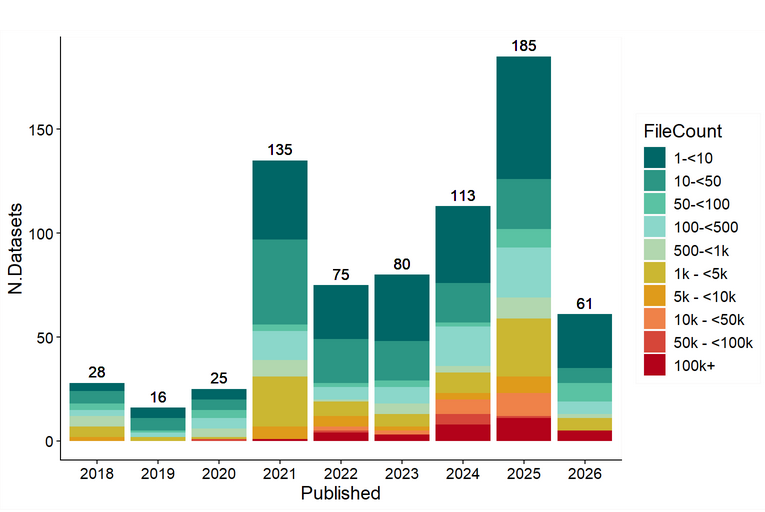
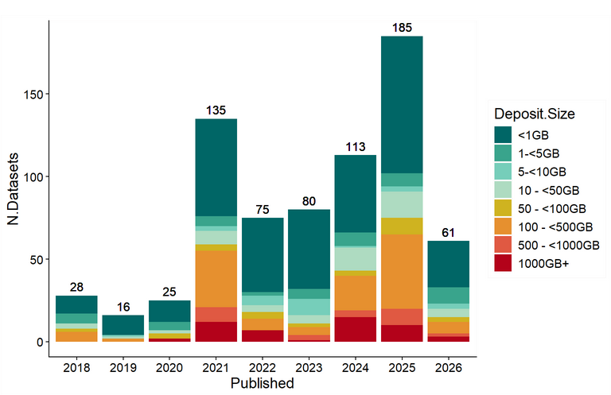
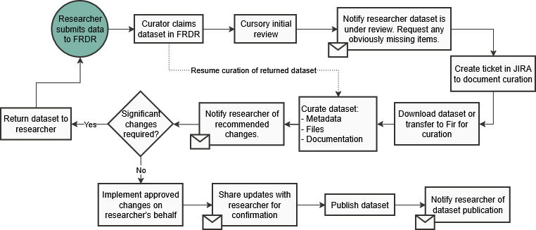
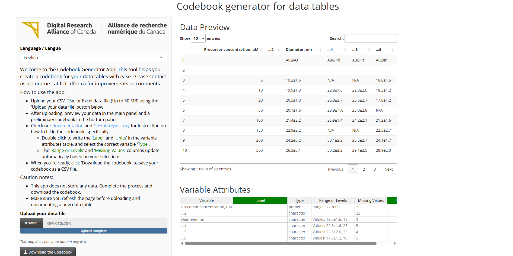

```{r}
#| include: false
library(knitr)

# Helper to find the latest file matching a pattern
get_latest_file <- function(dir, pattern) {
  if (!dir.exists(dir)) return(NULL)
  files <- list.files(dir, pattern = pattern, full.names = TRUE)
  if (length(files) == 0) return(NULL)
  files[which.max(file.info(files)$mtime)]
}
```

```{r}
# Helper function to run scripts safely and capture outputs
run_curation_script <- function(script, input_dir, output_dir = "Results") {
  script_path = file.path("../Scripts", script)
  if (!file.exists(script_path)) {
    return(paste("Error: Script not found at", script_path))
  }
  
  # Ensure the output directory exists
  if (!dir.exists(output_dir)) {
    dir.create(output_dir, recursive = TRUE)
  }
  
  # Standardize path arguments
  input_abs <- normalizePath(input_dir, mustWork = FALSE)
  output_abs <- normalizePath(output_dir, mustWork = FALSE)
  
  # Call Rscript on the script with the folder arguments
  res <- tryCatch({
    out <- system2(
      command = "Rscript", 
      args = c(shQuote(script_path), shQuote(input_abs), shQuote(output_abs)), 
      stdout = TRUE, 
      stderr = TRUE
    )
    # Filter out R package version compilation warnings
    if (length(out) > 0) {
      out <- out[!grepl("was built under R version", out, ignore.case = TRUE)]
      out <- out[!grepl("^Warning messages?:", out, ignore.case = TRUE)]
    }
    paste(out, collapse = "\n")
  }, error = function(e) {
    paste("Execution Error:", e$message)
  })
  
  return(res)
}

# Scan only curation-relevant top-level directories to avoid deep-scanning build/system/notebook folders
root_subdirs <- list.dirs("../", recursive = FALSE)
exclude_root <- "/\\.|^\\.\\./\\.|_book|_freeze|renv|book$|workshop$|_files|Notebook"
clean_root_subdirs <- root_subdirs[!grepl(exclude_root, root_subdirs)]

data_subdirs <- character()
if (dir.exists("../data")) {
  data_subdirs <- list.dirs("../data", recursive = TRUE)
}

all_paths <- unique(c("../", clean_root_subdirs, data_subdirs))
friendly_names <- gsub("^\\.\\./", "", all_paths)
friendly_names[friendly_names == "" | friendly_names == "."] <- "Project Root"
dir_choices <- setNames(all_paths, friendly_names)
```

## Workshop Outline 

::::: columns
::: {.column style="width: 40%; font-size: 0.6em;"}
### 1. Introduction and Context

-   **The Curation Challenge:** Scale and complexity.
-   **The Curation Toolbox:** Structured automation.
-   **Curation Workflows:** Manual vs. automated checks.
:::

::: {.column style="width: 60%; font-size: 0.6em;"}
### 2. Practical Demonstrations

-   High-Level Profiling (Extensions).
-   Tabular Quality Control (CSV Check).
-   Image Quality Control (Metadata and Fixity).
-   HDF5 (Hierarchies).
-   NetCDF (Arrays).
-   PDF (Security and Text).
-   SQLite (Schemas).
-   Tidy Data Screen (Table Structure).
-   README vs. Files (Documentation).
-   Designing for Scale (Principles).
:::
:::::

::: {.notes}
Here is our roadmap. We begin with a short introduction: what curation is, why large datasets are hard, and what the toolbox looks like. Then comes the practical part, nine short demonstrations, from a first look at file extensions to checking whether a README matches the files on disk. We close with a few ideas on designing for scale, how to run all of this on an HPC cluster, and how you can contribute. Everything I show today is open source.
:::

------------------------------------------------------------------------

## Context: What is Curation? {.smaller}

::::: columns
::: {.column style="width: 50%; font-size: 0.85em;"}
### Research Data Curation
The **ongoing process** of managing research data so that it is **FAIR**:

- **F**indable

- **A**ccessible

- **I**nteroperable

- **R**eusable

### Curation vs. Preservation
We organize, describe and clean files. Long-term preservation is handled by Digital Preservation services.
:::

::: {.column style="width: 50%; font-size: 0.85em;"}
### Generalist Repositories (FRDR)
The **Federated Research Data Repository** ([FRDR](https://www.frdr-dfdr.ca/repo/)) is a bilingual platform for sharing Canadian research data:

- **Well-documented**, **stand-alone** data.

- Medium-to-large datasets via [**Globus**](https://www.globus.org/data-transfer).

- Storage mirrored across national host sites.
:::
:::::

::: {.notes}
Let's start with a shared definition. Research data curation is the ongoing work of managing data so that it is FAIR: findable, accessible, interoperable and reusable. I want to flag one distinction up front: curation is not preservation. We organize, describe and clean files, while long-term preservation is handled by our Digital Preservation colleagues. On the right, FRDR, the Federated Research Data Repository, is where much of this work lands. It is bilingual, it handles medium-to-large datasets through Globus, and its storage is mirrored across national sites.
:::

------------------------------------------------------------------------

## The Scale of Large Datasets {.smaller}

::::: columns
::: {.column style="width: 35%; font-size: 0.8em;"}

### Growing Dataset Scale
Datasets keep growing in **file count** and **storage size**.

- **File Counts:** a few files up to **100K+**.

- **Storage Size:** under 1 GB up to **1000+ GB**.

- **Format Diversity:** hundreds of extensions (`csv`, `pdf`, `jpg`, `xlsx`).
:::

::: {.column style="width: 65%; text-align: center; layout-valign = center"}
::: {style="display: flex; gap: 10px; justify-content: center; align-items: center;"}
{style="width: 48%; border: 1px solid #ddd; border-radius: 4px; box-shadow: 0 2px 4px rgba(0,0,0,0.05);"}
{style="width: 48%; border: 1px solid #ddd; border-radius: 4px; box-shadow: 0 2px 4px rgba(0,0,0,0.05);"}
:::
<div style="font-size: 0.6em; margin-top: 10px; color: #555; font-style: italic;">Growth of dataset size and file counts over time (Digital Research Alliance of Canada).</div>
:::
:::::

::: {.notes}
Why do we talk about large datasets in particular? Because datasets keep growing, in two ways. In file count, from a handful of files up to more than a hundred thousand in a single deposit. And in size, from under a gigabyte to over a terabyte. On top of that, we see hundreds of different file extensions. The two charts show how both trends have climbed over time. This is the reality we design our workflows around.
:::

------------------------------------------------------------------------

## The Data Curation Workflow {.smaller}

::::: columns
::: {.column style="width: 40%; font-size: 0.8em;"}

We utilize the Data Curation Network's **CURATED** steps to ensure datasets meet high standards:

- **C**heck files and metadata.

- **U**nderstand and run files.

- **R**equest missing information.

- **A**ugment metadata.

- **T**ransform file formats.

- **E**valuate FAIRness.

- **D**ocument curation process throughout.
:::

::: {.column style="width: 60%; text-align: center;"}
{fig-alt="Data Curation Workflow Flowchart" style="border: 1px solid #ddd; border-radius: 4px; box-shadow: 0 4px 8px rgba(0,0,0,0.1); width: 100%;"}
<div style="font-size: 0.65em; margin-top: 5px; color: #555; font-style: italic;">FRDR interactive curation pipeline. Working with the researcher is an essential element of this project</div>
:::
:::::

::: {.notes}
To give our work some structure, we follow the CURATED steps from the Data Curation Network: Check files and metadata, Understand and run the files, Request missing information, Augment metadata, Transform formats, Evaluate FAIRness, and Document everything along the way. The toolbox you will see today lives mostly in the first two steps, Check and Understand, because that is where automation saves us the most time. And notice the caption under the diagram: working with the researcher is essential. Tools support that conversation, they never replace it.
:::

------------------------------------------------------------------------

## Curation Challenges and Bottlenecks {.smaller}

1. **Dataset Heterogeneity:** Number of files and format variety.

2. **Many Files:** processing tens of thousands of files quickly and consistently.

3. **Large Files:** gigabyte-scale files need serious computing power and memory.
   
4. **Varying Documentation:** Missing READMEs, orphaned variables, and obscure custom scripts.
   
5. **Reproducibility and Security:** hardcoded paths and PII (emails, keys), checked at scale.

::: {.notes}
So what makes this hard? Five things. First, heterogeneity: many formats and many layouts. Second, many files: how do you process tens of thousands of them quickly and consistently? Third, large files, which need serious computing power and memory. Fourth, documentation varies a lot, with missing READMEs and orphaned variables. And fifth, reproducibility and security: hardcoded paths, or personal information like emails and keys hiding inside files. Each demonstration that follows maps back to one or more of these challenges.
:::

------------------------------------------------------------------------

## Research Data Curation Toolbox {.smaller}

::::: columns
::: {.column style="width: 55%; font-size: 0.85em;"}

A collection of R, python and Bash scripts (in development) designed to:

1.  **Profile** directories and extensions automatically.
2.  **Deep-Dive** into tabular and scientific data.
3.  **Verify** code reproducibility and safety.

:::

::: {.column style="width: 45%; text-align: center;"}
{fig-alt="Data Curation Toolbox" style="border: 1px solid #ddd; border-radius: 4px; box-shadow: 0 4px 8px rgba(0,0,0,0.1); max-height: 420px; width: 100%;"}
:::
:::::

::: {.callout-note}
These workflows leverage [Quarto notebooks/books](https://quarto.org/docs/guide/) and automated R scripts to inspect datasets at scale and generate structured reports.
:::

::: {.notes}
This brings us to the toolbox. It is a collection of R, Python and Bash scripts, still in development, designed to do three things: profile directories and extensions automatically, dive deep into tabular and scientific data, and verify code reproducibility and safety. Each tool comes in two flavors: a Quarto notebook that explains every step, and a standalone script you can hand to a colleague or run on a cluster. Same logic, two ways to use it.
:::

# Practical Demonstrations

::: {.notes}
Time for the hands-on part. For every module I will follow the same rhythm: first why it matters, then the core logic of the script, and finally the results it produced on sample data. The tables and panels you will see were generated by the scripts themselves, not mocked up.
:::

## Module 1: High-Level Profiling {.smaller}

First-stage triage of an incoming dataset.

::::: columns
::: {.column style="width: 50%; font-size: 0.65em;"}
::: {.r-fit-text}
-   **Why:** Manual directory inspection is limited at scale.
-   **Obtained:**
    -   Inventory of extensions and sizes.
    -   Deep metadata (author, dates, MIME type).
    -   Risk flags (empty, junk, executables).
:::
:::

::: {.column style="width: 50%; font-size: 0.65em;"}
::: {.r-fit-text}
-   **Problems Solved:**
    -   *Extension mismatch:* hidden or falsified formats.
    -   *Security risks:* executables and junk.
    -   *Triage:* volume and complexity.
    -   *Scale:* ExifTool runs up to 2,000 files; the inventory always completes.
:::
:::
-   **Tools:** `tidyverse`, `ExifTool`, `exiftoolr`.

:::::

::: {.notes}
Module one: high-level profiling. Whenever a dataset arrives, this is the very first thing we run. Inspecting a directory by hand does not scale, so the script builds an inventory of every file: its extension, its size, and basic risk flags such as empty files, system junk or executables. It can also read deep metadata with ExifTool, like the author, the dates, and the real MIME type. That is how we catch a file whose extension says one thing but whose content says another. One design note: ExifTool is slow, so above two thousand files the script skips that step, but it always completes the inventory.
:::


------------------------------------------------------------------------

::::::: columns
:::: {.column style="width: 60%; font-size: 0.55em;"}
### Core Script Logic

``` r
# Inspect_Extensions_Script.R
# 1. Scans target directory
all_files <- list.files(
  path = target_dir,
  recursive = TRUE,
  full.names = TRUE,
  all.files = TRUE
)

# 2. Generates file inventory
inventory <- tibble(FullPath = all_files) %>%
  mutate(
    FileName = basename(FullPath),
    Extension = tolower(file_ext(FileName)),
    Size_Bytes = file.size(FullPath)
  )

# 3. Applies Risk Flags
junk_patterns <- c("\\.ds_store", "thumbs\\.db")
inventory <- inventory %>%
  mutate(Risk_Flag = case_when(
    Size_Bytes == 0 ~ "Zero-Byte File",
    str_detect(tolower(FileName), junk_patterns) ~ "Junk",
    TRUE ~ "Clean"
  ))
```

::: {style="font-size: 0.75em; margin-top: 10px; font-style: italic; color: #555;"}
*Core logic only. Full version: [script](https://github.com/Alliance-RDM-GDR/CUR_Res_CurationTools/blob/main/Scripts/Inspect_Extensions_Script.R) | [notebook](https://github.com/Alliance-RDM-GDR/CUR_Res_CurationTools/blob/main/Inspect_Extensions_Notebook.qmd).*
:::
::::

:::: {.column style="width: 40%;"}
::: control-card
<div style="font-size: 0.55em; font-weight: bold; color: #006666; margin-bottom: 8px; font-family: 'Ubuntu';">Execution Parameters</div>
<div style="font-size: 0.45em; margin-bottom: 4px; font-family: 'Montserrat';">
  <strong>Target Directory:</strong> <code>data/</code><br>
  <strong>Script:</strong> <code>Inspect_Extensions_Script.R</code><br>
  <strong>Command:</strong><br>
  <pre style="margin-top: 4px; margin-bottom: 0px; font-size: 0.85em; padding: 4px; background: #32322F; color: #FBFAFA; border-radius: 4px;">Rscript Inspect_Extensions_Script.R data/ Results/</pre>
</div>
:::
::::
:::::::

::: {.notes}
Here is the heart of the script, simplified. It lists every file recursively, builds a table with the name, extension and size, and applies a few simple rules to assign a risk flag. On the right you can see the exact command we run. If you would like the complete version, the links under the code open the script and the notebook.
:::

------------------------------------------------------------------------

### Profile Analysis and Diagnostic

::: {.column style="width: 45%; font-size: 0.55em;"}
```{r}
#| echo: false
#| results: asis

latest_summary_file <- get_latest_file("Results", "^Format_Summary_HPC_.*\\.csv$")
latest_inventory_file <- get_latest_file("Results", "^Full_Inventory_ExifTool_HPC_.*\\.csv$")

df <- if (!is.null(latest_summary_file)) read.csv(latest_summary_file, stringsAsFactors = FALSE) else NULL
inv <- if (!is.null(latest_inventory_file)) read.csv(latest_inventory_file, stringsAsFactors = FALSE) else NULL

if (is.null(df)) {
  cat("<div class='control-card' style='font-size: 0.85em; padding: 12px; margin-top: 15px;'>No data available. Please run the scripts locally first.</div>")
} else {
  total_files <- sum(df$Count)
  junk_files <- sum(df$Count[grepl("Junk", df$Risk_Flag, ignore.case = TRUE)])
  exec_files <- sum(df$Count[grepl("Executable", df$Risk_Flag, ignore.case = TRUE)])
  clean_files <- sum(df$Count[grepl("Clean", df$Risk_Flag, ignore.case = TRUE)])
  zero_files <- sum(df$Count[grepl("Zero", df$Risk_Flag, ignore.case = TRUE)])
  
  total_volume_text <- ""
  integrity_text <- ""
  pii_text <- ""
  
  if (!is.null(inv)) {
    if ("Size_MB" %in% names(inv)) {
      total_volume <- sum(inv$Size_MB, na.rm = TRUE)
      total_volume_text <- paste0("<strong>Total Volume:</strong> ", round(total_volume, 4), " MB<br>")
    }
    if ("Warning" %in% names(inv)) {
      warn_files <- inv[!is.na(inv$Warning) & inv$Warning != "", ]
      warnings_count <- nrow(warn_files)
      if (warnings_count > 0) {
        integrity_text <- paste0("<span style='color: #D6AB00; font-weight: bold;'>⚠️ INTEGRITY WARNING:</span> Found ", warnings_count, " file(s) with corruption/header warnings.<br>")
      }
    }
    if ("Author" %in% names(inv)) {
      author_files <- inv[!is.na(inv$Author) & inv$Author != "", ]
      pii_count <- nrow(author_files)
      if (pii_count > 0) {
        unique_authors <- unique(author_files$Author)
        pii_text <- paste0("<span style='color: #D6AB00; font-weight: bold;'>⚠️ PRIVACY ALERT:</span> Found ", pii_count, " file(s) with Author metadata (potential PII: ", paste(unique_authors, collapse = ", "), ").<br>")
      }
    }
  }
  
  diag_html <- paste0(
    "<div class='control-card' style='font-size: 0.85em; margin-top: 15px;'>",
    "<div style='font-weight: bold; color: #006666; margin-bottom: 8px;'>LIVE DIRECTORY METRICS</div>",
    "<strong>Total Scanned:</strong> ", total_files, " file(s)<br>",
    total_volume_text,
    "<strong>Clean Files:</strong> ", clean_files, "<br>"
  )
  
  if (zero_files > 0) {
    diag_html <- paste0(diag_html, "<span style='color: #D6AB00; font-weight: bold;'>⚠️ WARNING:</span> Found ", zero_files, " empty (zero-byte) file(s).<br>")
  }
  if (exec_files > 0) {
    diag_html <- paste0(diag_html, "<span style='color: #D6AB00; font-weight: bold;'>⚠️ SECURITY RISK:</span> Found ", exec_files, " executable file(s) (potential security preservation risk).<br>")
  }
  if (junk_files > 0) {
    diag_html <- paste0(diag_html, "<span style='color: #006666; font-weight: bold;'>ℹ️ SYSTEM JUNK:</span> Found ", junk_files, " system files (e.g. .DS_Store, Thumbs.db).<br>")
  }
  diag_html <- paste0(diag_html, integrity_text, pii_text)
  if (zero_files == 0 && exec_files == 0 && junk_files == 0 && integrity_text == "" && pii_text == "") {
    diag_html <- paste0(diag_html, "<span style='color: #006666; font-weight: bold;'>✔️ HEALTHY:</span> Directory structure matches preservation standards.<br>")
  }
  diag_html <- paste0(diag_html, "</div>")
  cat(diag_html)
}
```
:::

::: {.table-container}
```{r}
#| echo: false
if (!is.null(inv)) {
  display_df <- inv
  rename_map <- c(
    "FullPath" = "Full Path",
    "FileName" = "File Name",
    "RelativePath" = "Relative Path",
    "Extension" = "Extension",
    "Size_Bytes" = "Size (Bytes)",
    "Size_MB" = "Size (MB)",
    "Risk_Flag" = "Risk Flag",
    "MIMEType" = "MIME Type",
    "FileType" = "File Type",
    "Warning" = "Warning",
    "Author" = "Author"
  )
  names(display_df) <- sapply(names(display_df), function(name) {
    if (name %in% names(rename_map)) rename_map[name] else name
  })
  knitr::kable(display_df, format = "html", table.attr = "class='table table-striped table-hover'")
} else {
  cat("<p style='font-size:0.5em;'>No inventory data available.</p>")
}
```
:::

::: {.notes}
And here are the results on our sample folder. The panel on the left summarizes what the script found: how many files, the total volume, and any warnings. In this case the folder is clean. The table on the right is the full inventory, and you can scroll through it. On a real deposit, this is where we would spot zero-byte files or surprising formats.
:::

------------------------------------------------------------------------

## Module 2: Tabular Quality Control {.smaller}

Automated structure and content checks for tabular files.

::::: columns
::: {.column style="width: 50%; font-size: 0.65em;"}
::: {.r-fit-text}
-   **Why:** Tabular files hide parsing errors, gaps and PII leaks.
-   **Obtained:**
    -   Encoding and schema (rows, columns).
    -   Completeness percentage.
    -   Duplicate rows and email PII checks.
:::
:::

::: {.column style="width: 50%; font-size: 0.65em;"}
::: {.r-fit-text}
-   **Problems Solved:**
    -   *Parsing issues:* encoding or structure corruption.
    -   *Data gaps:* missing values, measured.
    -   *Privacy risks:* raw emails and contacts.
:::
:::
-   **Tools:** `tidyverse`, `readr`, `skimr`.

:::::

::: {.notes}
Module two: tabular quality control. CSV files look simple, but they hide plenty of problems: odd encodings, missing values, duplicated rows, even email addresses in a column nobody remembered. The script reads every CSV and reports its encoding, its rows and columns, the percentage of complete cells, the duplicate rows, and whether it spotted anything that looks like an email address. It also profiles every variable in detail with the skimr package. And each report ships with a codebook that explains its columns, so nobody has to guess what "percent complete" means.
:::

------------------------------------------------------------------------

:::::: columns
::: {.column style="width: 60%; font-size: 0.55em;"}
### Core Script Logic

``` r
# Inspect_csv_Script.R
# 1. Scans CSVs and runs a health check
analyze_csv_health <- function(file_path) {
  df <- read_csv(file_path, show_col_types = FALSE)
  n_rows <- nrow(df)
  n_cols <- ncol(df)
  n_missing <- sum(is.na(df))
  
  # 2. Regex Check for Email PII
  email_pattern <- "[a-zA-Z0-9._%+-]+@[a-zA-Z0-9.-]+"
  char_cols <- select(df, where(is.character))
  pii_found <- any(str_detect(char_cols, email_pattern))
  
  tibble(
    FileName = basename(file_path),
    Rows = n_rows,
    Cols = n_cols,
    Pct_Complete = round(100 * (1 - n_missing/n_cells), 2),
    PII_Risk = pii_found
  )
}
```

::: {style="font-size: 0.75em; margin-top: 10px; font-style: italic; color: #555;"}
*Core logic only. Full version: [script](https://github.com/Alliance-RDM-GDR/CUR_Res_CurationTools/blob/main/Scripts/Inspect_csv_Script.R) | [notebook](https://github.com/Alliance-RDM-GDR/CUR_Res_CurationTools/blob/main/Inspect_csv_Notebook.qmd).*
:::
:::

:::: {.column style="width: 40%;"}
::: control-card
<div style="font-size: 0.55em; font-weight: bold; color: #006666; margin-bottom: 8px; font-family: 'Ubuntu';">Execution Parameters</div>
<div style="font-size: 0.45em; margin-bottom: 4px; font-family: 'Montserrat';">
  <strong>Target Directory:</strong> <code>data/</code><br>
  <strong>Script:</strong> <code>Inspect_csv_Script.R</code><br>
  <strong>Command:</strong><br>
  <pre style="margin-top: 4px; margin-bottom: 0px; font-size: 0.85em; padding: 4px; background: #32322F; color: #FBFAFA; border-radius: 4px;">Rscript Inspect_csv_Script.R data/ Results/</pre>
</div>
:::
::::
::::::

::: {.notes}
The core idea is straightforward: read each file, count rows and columns, count the missing cells to get a completeness percentage, and use a regular expression to search the text columns for email patterns. These are simple checks, but when you run them across hundreds of files, they save hours.
:::

------------------------------------------------------------------------

::::: columns
::: {.column style="width: 50%; font-size: 0.60em;"}
### Tabular Analysis and Diagnostic

::: {.r-fit-text}
```{r}
#| echo: false
#| results: asis

# Must end in a date so the companion CSV_Health_Check_Codebook.csv is never picked up
latest_csv_file <- get_latest_file("Results", "^CSV_Health_Check.*[0-9]{4}-[0-9]{2}-[0-9]{2}\\.csv$")
df <- if (!is.null(latest_csv_file)) read.csv(latest_csv_file, stringsAsFactors = FALSE) else NULL

if (is.null(df)) {
  cat("<div class='control-card' style='font-size: 0.85em; padding: 12px; margin-top: 15px;'>No data available. Please run the scripts locally first.</div>")
} else {
  total_files <- nrow(df)
  total_volume <- sum(df$Size_MB, na.rm = TRUE)
  failed_files <- sum(grepl("Read Failed", df$Status, ignore.case = TRUE))
  success_files <- sum(df$Status == "Success", na.rm = TRUE)
  total_duplicates <- sum(df$Duplicate_Rows, na.rm = TRUE)
  pii_files <- sum(df$PII_Risk == TRUE, na.rm = TRUE)
  
  diag_html <- paste0(
    "<div class='control-card' style='font-size: 0.85em; margin-top: 15px;'>",
    "<div style='font-weight: bold; color: #006666; margin-bottom: 8px;'>LIVE TABULAR METRICS</div>",
    "<strong>Total Audited:</strong> ", total_files, " CSV file(s)<br>",
    "<strong>Total Volume:</strong> ", round(total_volume, 4), " MB<br>",
    "<strong>Successfully Parsed:</strong> ", success_files, "<br>"
  )
  if (failed_files > 0) {
    diag_html <- paste0(diag_html, "<span style='color: #D6AB00; font-weight: bold;'>⚠️ INTEGRITY FAILURE:</span> ", failed_files, " file(s) failed to read correctly.<br>")
  }
  if (total_duplicates > 0) {
    diag_html <- paste0(diag_html, "<span style='color: #D6AB00; font-weight: bold;'>⚠️ REDUNDANCY WARNING:</span> Found ", total_duplicates, " duplicate row(s) across files.<br>")
  }
  if (pii_files > 0) {
    diag_html <- paste0(diag_html, "<span style='color: #D6AB00; font-weight: bold;'>⚠️ PRIVACY RISK:</span> ", pii_files, " file(s) flagged for containing potential email PII.<br>")
  }
  if (failed_files == 0 && total_duplicates == 0 && pii_files == 0) {
    diag_html <- paste0(diag_html, "<span style='color: #006666; font-weight: bold;'>✔️ HEALTHY:</span> All CSV files successfully passed structure, redundancy, and privacy audits.<br>")
  }
  diag_html <- paste0(diag_html, "</div>")
  cat(diag_html)
}
```
:::
:::

::: {.column style="width: 50%; font-size: 0.55em;"}
### CSV Health Check Summary

::: {.table-container}
```{r}
#| echo: false
#| results: asis
if (!is.null(df)) {
  display_df <- df
  rename_map <- c(
    "FileName" = "File Name",
    "Size_MB" = "Size (MB)",
    "Encoding" = "Encoding",
    "Rows" = "Rows",
    "Cols" = "Cols",
    "Pct_Complete" = "Complete %",
    "Duplicate_Rows" = "Duplicates",
    "PII_Risk" = "PII Risk",
    "Status" = "Status"
  )
  names(display_df) <- sapply(names(display_df), function(name) {
    if (name %in% names(rename_map)) rename_map[name] else name
  })
  knitr::kable(display_df, format = "html", table.attr = "class='table table-striped table-hover'")
} else {
  cat("<p style='font-size:0.5em;'>No CSV summary data available.</p>")
}
```
:::
:::
:::::

::: {.notes}
On our sample folder, fifteen CSV files were audited and all of them parsed correctly. The panel gives us the total volume, how many files were read successfully, and it raises a flag for problems like duplicates or possible personal information. When one of those flags lights up, that is our cue to open the file and take a careful look. The table on the right gives the per-file detail: encoding, rows, columns and completeness.
:::

------------------------------------------------------------------------

## Documenting data tables {.smaller}

Standardizing tabular data documentation with the Codebook Generator App.

::::: columns
::: {.column style="width: 45%;"}
::: {.r-fit-text}
::: {.control-card style="margin-bottom: 12px; font-size: 0.85em; padding: 12px;"}
<div style="font-size: 1.05em; font-weight: bold; color: #006666; margin-bottom: 6px; font-family: 'Ubuntu';">Bilingual Documentation</div>

- **Interactive Editing:** labels, types and units.
- **Auto-Profiling:** types, ranges, missing values.
- **Bilingual Interface:** English and French.
:::

::: {.control-card style="font-size: 0.85em; padding: 12px;"}
<div style="font-size: 1.05em; font-weight: bold; color: #006666; margin-bottom: 6px; font-family: 'Ubuntu';">Privacy and Zero-Install</div>

- **Zero-Server:** runs entirely in your browser (Shinylive).
- **Local Privacy:** your data never leaves the browser.
- **Formats:** CSV, TSV and XLSX up to 30 MB.
:::
:::
:::

::: {.column style="width: 55%; text-align: center;"}
{fig-alt="Codebook Generator App" style="border: 1px solid #ddd; border-radius: 4px; box-shadow: 0 4px 8px rgba(0,0,0,0.1); width: 100%; margin-top: 10px;"}

<div style="margin-top: 15px; font-size: 0.8em;">
📦 **Explore the App:** &nbsp; [Interactive Live Demo](https://alliance-rdm-gdr.github.io/RDM_Codebook_App/) &nbsp;|&nbsp; 📖 [GitHub Repository](https://github.com/Alliance-RDM-GDR/RDM_Codebook_App)
</div>
:::
:::::

::: {.notes}
A quick detour that connects with what we just saw. Once you know what is inside a table, you need to document it. For that we built the Codebook Generator, a small app that profiles a table and lets you edit labels, types and units. It works in English and in French, and it runs entirely in your browser, so your data never leaves your computer. There is a live demo link on the slide if you would like to try it after the workshop.
:::

-------------------------------------------------------------------------

## Module 3: Image Quality Control {.smaller}

Technical validation, fixity and metadata for image collections.

::::: columns
::: {.column style="width: 50%; font-size: 0.65em;"}
::: {.r-fit-text}
-   **Why:** Images can carry hidden GPS coordinates or corrupt headers.
-   **Obtained:**
    -   Width, height, format, colorspace.
    -   MD5 checksum for fixity and duplicates.
    -   Embedded Exif metadata.
:::
:::

::: {.column style="width: 50%; font-size: 0.65em;"}
::: {.r-fit-text}
-   **Problems Solved:**
    -   *Privacy risks:* GPS leaks (people, protected species).
    -   *Outliers:* wrong colorspace or dimensions.
    -   *Obsolescence:* raw formats to convert to TIFF.
:::
:::
-   **Tools:** `magick`, `exiftoolr`, `digest`.

:::::

::: {.notes}
Module three: images. Images are deceptively complex. They can carry hidden GPS coordinates in their metadata, which matters a great deal when the photos involve people or protected species. The script checks that each file opens, records width, height, format and colorspace, and computes an MD5 checksum, which serves two purposes: fixity, and detecting duplicates. It also reads the embedded Exif metadata, and flags outliers, such as an image whose dimensions differ from the rest of the collection.
:::

------------------------------------------------------------------------

:::::: columns
::: {.column style="width: 60%; font-size: 0.55em;"}
### Core Script Logic

``` r
# Inspect_Images_Script.R
# 1. Hashing for Fixity
file_inventory <- file_inventory %>%
  mutate(md5_checksum = map_chr(file_path, digest, file = TRUE, algo = "md5"))

# 2. Geometry Validation (magick)
magick_results <- map_dfr(image_files, function(fp) {
  img <- image_read(fp)
  info <- image_info(img)
  tibble(format_magick = info$format, width = info$width, height = info$height)
})

# 3. Apply Curation Flags
curated_data <- full_report %>%
  mutate(
    flag_duplicate = ifelse(is_duplicate, "DUPLICATE", NA),
    flag_privacy_gps = ifelse(!is.na(GPSLatitude), "HAS_GPS_DATA", NA)
  )
```

::: {style="font-size: 0.75em; margin-top: 10px; font-style: italic; color: #555;"}
*Core logic only. Full version: [script](https://github.com/Alliance-RDM-GDR/CUR_Res_CurationTools/blob/main/Scripts/Inspect_Images_Script.R) | [notebook](https://github.com/Alliance-RDM-GDR/CUR_Res_CurationTools/blob/main/Inspect_Images_Notebook.qmd).*
:::
:::

:::: {.column style="width: 40%;"}
::: control-card
<div style="font-size: 0.55em; font-weight: bold; color: #006666; margin-bottom: 8px; font-family: 'Ubuntu';">Execution Parameters</div>
<div style="font-size: 0.45em; margin-bottom: 4px; font-family: 'Montserrat';">
  <strong>Target Directory:</strong> <code>data/</code><br>
  <strong>Script:</strong> <code>Inspect_Images_Script.R</code><br>
  <strong>Command:</strong><br>
  <pre style="margin-top: 4px; margin-bottom: 0px; font-size: 0.85em; padding: 4px; background: #32322F; color: #FBFAFA; border-radius: 4px;">Rscript Inspect_Images_Script.R data/ Results/Inspect_Images/</pre>
</div>
:::
::::
::::::

::: {.notes}
In the core logic, we hash every file, open each one with magick to validate its header and read its geometry, and then apply the curation flags: duplicate, corrupt, GPS present, and dimension outlier. The flags are plain text, so you can filter the results table directly.
:::

------------------------------------------------------------------------

::::: columns
::: {.column style="width: 45%; font-size: 0.55em;"}

### Image Analysis and Diagnostic

```{r}
#| echo: false
#| results: asis

latest_images_file <- get_latest_file("Results/Inspect_Images", "^Curation_Report_Images_.*\\.csv$")
df <- if (!is.null(latest_images_file)) read.csv(latest_images_file, stringsAsFactors = FALSE) else NULL

if (is.null(df)) {
  cat("<div class='control-card' style='font-size: 0.85em; padding: 12px; margin-top: 15px;'>No data available. Please run the scripts locally first.</div>")
} else {
  total_files <- nrow(df)
  corrupt_files <- sum(!is.na(df$flag_corrupt) & df$flag_corrupt != "")
  duplicate_files <- sum(!is.na(df$flag_duplicate) & df$flag_duplicate != "")
  gps_files <- sum(!is.na(df$flag_privacy_gps) & df$flag_privacy_gps != "")
  outlier_files <- sum(!is.na(df$flag_outlier) & df$flag_outlier != "")
  
  diag_html <- paste0(
    "<div class='control-card' style='font-size: 0.85em; margin-top: 15px;'>",
    "<div style='font-weight: bold; color: #006666; margin-bottom: 8px;'>LIVE IMAGE METRICS</div>",
    "<strong>Total Audited:</strong> ", total_files, " file(s)<br>"
  )
  if (corrupt_files > 0) {
    diag_html <- paste0(diag_html, "<span style='color: #D6AB00; font-weight: bold;'>⚠️ CORRUPTION:</span> Found ", corrupt_files, " unreadable image file(s).<br>")
  }
  if (duplicate_files > 0) {
    diag_html <- paste0(diag_html, "<span style='color: #D6AB00; font-weight: bold;'>⚠️ DUPLICATES:</span> Found ", duplicate_files, " duplicate image file(s).<br>")
  }
  if (gps_files > 0) {
    diag_html <- paste0(diag_html, "<span style='color: #D6AB00; font-weight: bold;'>⚠️ PRIVACY RISK:</span> Found ", gps_files, " image(s) with embedded GPS data.<br>")
  }
  if (outlier_files > 0) {
    diag_html <- paste0(diag_html, "<span style='color: #006666; font-weight: bold;'>ℹ️ OUTLIERS:</span> Found ", outlier_files, " image(s) with non-standard dimensions.<br>")
  }
  if (corrupt_files == 0 && duplicate_files == 0 && gps_files == 0 && outlier_files == 0) {
    diag_html <- paste0(diag_html, "<span style='color: #006666; font-weight: bold;'>✔️ HEALTHY:</span> All images parsed successfully and passed all curation audits.<br>")
  }
  diag_html <- paste0(diag_html, "</div>")
  cat(diag_html)
}
```
:::
:::::

::: {.table-container}
```{r}
#| echo: false
if (!is.null(df)) {
  display_df <- df
  rename_map <- c(
    "file_path" = "File Path",
    "filename" = "File Name",
    "md5_checksum" = "MD5 Checksum",
    "format_magick" = "Format",
    "width" = "Width",
    "height" = "Height",
    "colorspace" = "Colorspace",
    "filesize_mb" = "Size (MB)",
    "valid_image" = "Valid Image",
    "Megapixels" = "Megapixels",
    "GPSLatitude" = "GPS Latitude",
    "is_duplicate" = "Is Duplicate",
    "curation_flags" = "Curation Flags",
    "flag_duplicate" = "Flag Duplicate",
    "flag_corrupt" = "Flag Corrupt",
    "flag_privacy_gps" = "Flag GPS",
    "flag_outlier" = "Flag Outlier"
  )
  names(display_df) <- sapply(names(display_df), function(name) {
    if (name %in% names(rename_map)) rename_map[name] else name
  })
  knitr::kable(display_df, format = "html", table.attr = "class='table table-striped table-hover'")
} else {
  cat("<p style='font-size:0.5em;'>No image summary data available.</p>")
}
```
:::

::: {.notes}
Here are the results for four sample images. The panel summarizes corruption, duplicates, embedded GPS data and dimension outliers, and here everything came back healthy. In a real collection, the GPS flag is the one we take most seriously, and we would talk with the researcher about removing those coordinates or reducing their precision.
:::

------------------------------------------------------------------------

## Module 4: HDF5 Structure and Metadata {.smaller}

Hierarchy, object mapping and attributes of HDF5 files.

::::: columns
::: {.column style="width: 50%; font-size: 0.65em;"}
::: {.r-fit-text}
-   **Why:** HDF5 is a binary "black box" of nested groups and datasets.
-   **Obtained:**
    -   Map of groups, datasets and links.
    -   Data types and dimensions.
    -   Compression filters and user attributes.
:::
:::

::: {.column style="width: 50%; font-size: 0.65em;"}
::: {.r-fit-text}
-   **Problems Solved:**
    -   *Proprietary compression:* filters that block reading.
    -   *Broken links:* external files that are missing.
    -   *Missing documentation:* datasets without attributes.
:::
:::
-   **Tools:** `hdf5r`.

:::::

::: {.notes}
Module four: HDF5. This format is wonderful for scientific data, but from the outside it is a black box: groups inside groups, datasets, attributes. The script opens each file and maps the whole hierarchy: groups, datasets and links, their data types and dimensions, the compression filters in use, and the user attributes. Why does that matter? Some compression filters are proprietary and can lock future users out, external links can point to files that were never deposited, and datasets without attributes leave their units a mystery.
:::

------------------------------------------------------------------------

:::::: columns
::: {.column style="width: 60%; font-size: 0.55em;"}
### Core Script Logic

``` r
# Inspect_hdf5_Script.R
# 1. Open file and list recursively
h5f <- H5File$new(file_path, mode = "r")
contents <- h5f$ls(recursive = TRUE)

# 2. Extract properties & compression
dcpl <- dset$create_plist
n_filters <- dcpl$get_nfilters()
filters <- map_chr(0:(n_filters - 1), ~ dcpl$get_filter(.x)$name)

# 3. Detect External Link Risk
if (link_type == "H5L_TYPE_EXTERNAL") {
  # Flag external dependency risk
}
```

::: {style="font-size: 0.75em; margin-top: 10px; font-style: italic; color: #555;"}
*Core logic only. Full version: [script](https://github.com/Alliance-RDM-GDR/CUR_Res_CurationTools/blob/main/Scripts/Inspect_hdf5_Script.R) | [notebook](https://github.com/Alliance-RDM-GDR/CUR_Res_CurationTools/blob/main/Inspect_hdf5_Notebook.qmd).*
:::
:::

:::: {.column style="width: 40%;"}
::: control-card
<div style="font-size: 0.55em; font-weight: bold; color: #006666; margin-bottom: 8px; font-family: 'Ubuntu';">Execution Parameters</div>
<div style="font-size: 0.45em; margin-bottom: 4px; font-family: 'Montserrat';">
  <strong>Target Directory:</strong> <code>data/Inspect_hdf5/</code><br>
  <strong>Script:</strong> <code>Inspect_hdf5_Script.R</code><br>
  <strong>Command:</strong><br>
  <pre style="margin-top: 4px; margin-bottom: 0px; font-size: 0.85em; padding: 4px; background: #32322F; color: #FBFAFA; border-radius: 4px;">Rscript Inspect_hdf5_Script.R data/Inspect_hdf5/ Results/</pre>
</div>
:::
::::
::::::

::: {.notes}
The logic is a recursive walk through the file. For every dataset we read the dimensions and the data type, ask for the compression filters, and mark any link that points to an external file as a dependency risk.
:::

------------------------------------------------------------------------

::::: columns
::: {.column style="width: 45%; font-size: 0.55em;"}
### HDF5 Analysis and Diagnostic
```{r}
#| echo: false
#| results: asis

latest_hdf5_file <- get_latest_file("Results", "^HDF5_Structure_HPC_.*\\.csv$")
df <- if (!is.null(latest_hdf5_file)) read.csv(latest_hdf5_file, stringsAsFactors = FALSE) else NULL

if (is.null(df)) {
  cat("<div class='control-card' style='font-size: 0.85em; padding: 12px; margin-top: 15px;'>No data available. Please run the scripts locally first.</div>")
} else {
  total_objects <- nrow(df)
  datasets <- sum(df$Type == "H5I_DATASET", na.rm = TRUE)
  groups <- sum(df$Type == "H5I_GROUP", na.rm = TRUE)
  errors <- sum(df$Type == "ERROR" | grepl("Failed", df$Status), na.rm = TRUE)
  szip_count <- sum(grepl("szip", df$Compression, ignore.case = TRUE))
  lzf_count <- sum(grepl("lzf", df$Compression, ignore.case = TRUE))
  ext_links <- sum(df$Type == "EXTERNAL_LINK", na.rm = TRUE)
  
  diag_html <- paste0(
    "<div class='control-card' style='font-size: 0.85em; margin-top: 15px;'>",
    "<div style='font-weight: bold; color: #006666; margin-bottom: 8px;'>LIVE HDF5 METRICS</div>",
    "<strong>Total Objects:</strong> ", total_objects, " (", datasets, " datasets, ", groups, " groups)<br>"
  )
  if (errors > 0) {
    diag_html <- paste0(diag_html, "<span style='color: #D6AB00; font-weight: bold;'>⚠️ ERRORES:</span> Found ", errors, " files that failed reading.<br>")
  }
  if (szip_count > 0 || lzf_count > 0) {
    diag_html <- paste0(diag_html, "<span style='color: #D6AB00; font-weight: bold;'>⚠️ PROPRIETARY COMPRESSION:</span> Detected non-standard compression (SZIP/LZF) in ", szip_count + lzf_count, " dataset(s). GZIP is preferred.<br>")
  }
  if (ext_links > 0) {
    diag_html <- paste0(diag_html, "<span style='color: #D6AB00; font-weight: bold;'>⚠️ EXTERNAL LINKS:</span> Found ", ext_links, " external dependencies.<br>")
  }
  if (errors == 0 && szip_count == 0 && lzf_count == 0 && ext_links == 0) {
    diag_html <- paste0(diag_html, "<span style='color: #006666; font-weight: bold;'>✔️ HEALTHY:</span> All HDF5 hierarchies parsed successfully. No external link dependencies or risky custom compression filters detected.<br>")
  }
  diag_html <- paste0(diag_html, "</div>")
  cat(diag_html)
}
```
:::
:::::

::: {.table-container}
```{r}
#| echo: false
if (!is.null(df)) {
  display_df <- df
  rename_map <- c(
    "FileName" = "File Name",
    "Path" = "Object Path",
    "Type" = "Object Type",
    "Dimensions" = "Dimensions",
    "DataType" = "Data Type",
    "Compression" = "Compression",
    "Attributes" = "Attributes",
    "Status" = "Status"
  )
  names(display_df) <- sapply(names(display_df), function(name) {
    if (name %in% names(rename_map)) rename_map[name] else name
  })
  knitr::kable(display_df, format = "html", table.attr = "class='table table-striped table-hover'")
} else {
  cat("<p style='font-size:0.5em;'>No HDF5 structure data available.</p>")
}
```
:::

::: {.notes}
On our sample, the script found 730 objects: 390 datasets and 340 groups. There are no external links and no risky compression filters, so the panel gives it a clean bill of health. The table lists every object with its path, type, dimensions and compression. In practice, it is an instant table of contents for the file.
:::

------------------------------------------------------------------------

## Module 5: NetCDF Usability and Conventions {.smaller}

Array, CF-convention and coordinate checks for NetCDF files.

::::: columns
::: {.column style="width: 50%; font-size: 0.65em;"}
::: {.r-fit-text}
-   **Why:** Without metadata conventions, grids and units cannot be interpreted.
-   **Obtained:**
    -   Spatial reference (CRS / grid mapping).
    -   Climate and Forecast (CF) conventions.
    -   Empty-array detection.
:::
:::

::: {.column style="width: 50%; font-size: 0.65em;"}
::: {.r-fit-text}
-   **Problems Solved:**
    -   *Non-compliance:* missing `Conventions` attribute.
    -   *Sparsity:* variables that are 100% NaN.
    -   *Georeferencing gaps:* no CRS for GIS.

-   **Tools:** `tidync`, `ncmeta`.
:::
:::

:::::

::: {.notes}
Module five: NetCDF, the workhorse of climate and earth-science data. Here the question is usability. Without metadata conventions, a grid of numbers is just numbers, because nobody knows the coordinates or the units. The script checks for a spatial reference or grid mapping, looks at the Climate and Forecast conventions, and samples each variable to detect arrays that are completely empty. That last check matters: a file can be perfectly valid and still contain nothing but missing values.
:::

------------------------------------------------------------------------

:::::: columns
::: {.column style="width: 60%; font-size: 0.55em;"}
### Core Script Logic

``` r
# Inspect_nc_Script.R
# 1. Scan coordinates & dimensions
dims <- tnc %>% hyper_dims()
has_lat <- any(str_detect(dims$name, "(?i)lat|y"))

# 2. Check Conventions and CRS
all_atts <- ncmeta::nc_atts(fp)
has_grid_mapping <- any(all_atts$name == "grid_mapping")

# 3. Sparsity Audit
sample_data <- tnc %>% activate(first_var) %>% hyper_tibble(select_var = first_var)
if (all(is.na(sample_data[[first_var]]))) {
  # Flag empty dataset warning
}
```

::: {style="font-size: 0.75em; margin-top: 10px; font-style: italic; color: #555;"}
*Core logic only. Full version: [script](https://github.com/Alliance-RDM-GDR/CUR_Res_CurationTools/blob/main/Scripts/Inspect_nc_Script.R) | [notebook](https://github.com/Alliance-RDM-GDR/CUR_Res_CurationTools/blob/main/Inspect_nc_Notebook.qmd).*
:::
:::

:::: {.column style="width: 40%;"}
::: control-card
<div style="font-size: 0.55em; font-weight: bold; color: #006666; margin-bottom: 8px; font-family: 'Ubuntu';">Execution Parameters</div>
<div style="font-size: 0.45em; margin-bottom: 4px; font-family: 'Montserrat';">
  <strong>Target Directory:</strong> <code>data/Inspect_nc/</code><br>
  <strong>Script:</strong> <code>Inspect_nc_Script.R</code><br>
  <strong>Command:</strong><br>
  <pre style="margin-top: 4px; margin-bottom: 0px; font-size: 0.85em; padding: 4px; background: #32322F; color: #FBFAFA; border-radius: 4px;">Rscript Inspect_nc_Script.R data/Inspect_nc/ Results/Inspect_nc/</pre>
</div>
:::
::::
::::::

::: {.notes}
In the core logic, we look at the dimensions to see whether there are latitude and longitude, check for a grid mapping attribute, and then read a small sample of the first variable to confirm that it holds real data.
:::

------------------------------------------------------------------------

::::: columns
::: {.column style="width: 45%; font-size: 0.55em;"}
### NetCDF Analysis and Diagnostic
```{r}
#| echo: false
#| results: asis

latest_nc_file <- get_latest_file("Results/Inspect_nc", "^NetCDF_Inventory_.*\\.csv$")
df <- if (!is.null(latest_nc_file)) read.csv(latest_nc_file, stringsAsFactors = FALSE) else NULL

if (is.null(df)) {
  cat("<div class='control-card' style='font-size: 0.85em; padding: 12px; margin-top: 15px;'>No data available. Please run the scripts locally first.</div>")
} else {
  total_files <- nrow(df)
  corrupt_files <- sum(df$Status == "Corrupt/Unreadable", na.rm = TRUE)
  no_crs <- sum(df$HasCRS == "No Spatial Grid", na.rm = TRUE)
  empty_files <- sum(grepl("Empty", df$DataHealth), na.rm = TRUE)
  
  diag_html <- paste0(
    "<div class='control-card' style='font-size: 0.85em; margin-top: 15px;'>",
    "<div style='font-weight: bold; color: #006666; margin-bottom: 8px;'>LIVE NETCDF METRICS</div>",
    "<strong>Total Audited:</strong> ", total_files, " file(s)<br>"
  )
  if (corrupt_files > 0) {
    diag_html <- paste0(diag_html, "<span style='color: #D6AB00; font-weight: bold;'>⚠️ CORRUPT:</span> Found ", corrupt_files, " unreadable NetCDF file(s).<br>")
  }
  if (no_crs > 0) {
    diag_html <- paste0(diag_html, "<span style='color: #D6AB00; font-weight: bold;'>⚠️ GEOREFERENCING RISK:</span> Found ", no_crs, " file(s) with no spatial CRS mapping.<br>")
  }
  if (empty_files > 0) {
    diag_html <- paste0(diag_html, "<span style='color: #D6AB00; font-weight: bold;'>⚠️ EMPTY ARRAYS:</span> Found ", empty_files, " file(s) containing 100% NaNs.<br>")
  }
  if (corrupt_files == 0 && no_crs == 0 && empty_files == 0) {
    diag_html <- paste0(diag_html, "<span style='color: #006666; font-weight: bold;'>✔️ HEALTHY:</span> All NetCDF files are georeferenced, valid, and contain non-empty data arrays.<br>")
  }
  diag_html <- paste0(diag_html, "</div>")
  cat(diag_html)
}
```
:::
:::::

::: {.table-container}
```{r}
#| echo: false
if (!is.null(df)) {
  display_df <- df
  rename_map <- c(
    "FileName" = "File Name",
    "Status" = "Status",
    "DimsSummary" = "Dimensions Summary",
    "VarCount" = "Variables",
    "HasCRS" = "Has CRS",
    "DataHealth" = "Data Health"
  )
  names(display_df) <- sapply(names(display_df), function(name) {
    if (name %in% names(rename_map)) rename_map[name] else name
  })
  knitr::kable(display_df, format = "html", table.attr = "class='table table-striped table-hover'")
} else {
  cat("<p style='font-size:0.5em;'>No NetCDF inventory data available.</p>")
}
```
:::

::: {.notes}
Six NetCDF files were audited. All of them are georeferenced and readable, and the Data Health column says each one contains data. Keep an eye on that last column: if a file had been all missing values, it would show up there, and the panel would raise a warning.
:::

------------------------------------------------------------------------

## Module 6: PDF Archival Suitability {.smaller}

Encryption, text accessibility and font checks for PDFs.

::::: columns
::: {.column style="width: 50%; font-size: 0.65em;"}
-   **Why:** PDFs can be encrypted or image-only scans.
-   **Obtained:**
    -   Encryption status.
    -   Searchable text versus image-only.
    -   Pages, author, title, creator.
    -   Embedded fonts.
:::

::: {.column style="width: 50%; font-size: 0.65em;"}
-   **Problems Solved:**
    -   *Encryption locks:* block indexing and preservation.
    -   *Image-only scans:* OCR needed.
    -   *Missing metadata:* empty or generic author and title.
:::
-   **Tools:** `pdftools`.
:::::

::: {.notes}
Module six: PDFs. Everyone deposits them, and they are great for documentation, but two hidden traps are common. The first is encryption, which blocks indexing and preservation. The second is scanned documents with no text layer, which look fine on screen but are invisible to search engines and screen readers. The script reports the encryption status, whether there is searchable text, basic metadata such as pages, author and title, and which fonts are embedded.
:::

------------------------------------------------------------------------

:::::: columns
::: {.column style="width: 60%; font-size: 0.55em;"}
### Core Script Logic

``` r
# Inspect_PDF_Script.R
# 1. Check metadata and security
info <- pdftools::pdf_info(file_path)
is_encrypted <- isTRUE(info$encrypted)

# 2. Extract text and check accessibility
first_page_text <- pdftools::pdf_text(file_path)[1]
char_count <- nchar(trimws(first_page_text))
has_text <- char_count > 10 # Searchable check

# 3. Check embedded fonts
fonts <- pdftools::pdf_fonts(file_path)
```

::: {style="font-size: 0.75em; margin-top: 10px; font-style: italic; color: #555;"}
*Core logic only. Full version: [script](https://github.com/Alliance-RDM-GDR/CUR_Res_CurationTools/blob/main/Scripts/Inspect_PDF_Script.R) | [notebook](https://github.com/Alliance-RDM-GDR/CUR_Res_CurationTools/blob/main/Inspect_PDF_Notebook.qmd).*
:::
:::

:::: {.column style="width: 40%;"}
::: control-card
<div style="font-size: 0.55em; font-weight: bold; color: #006666; margin-bottom: 8px; font-family: 'Ubuntu';">Execution Parameters</div>
<div style="font-size: 0.45em; margin-bottom: 4px; font-family: 'Montserrat';">
  <strong>Target Directory:</strong> <code>data/Inspect_pdf/</code><br>
  <strong>Script:</strong> <code>Inspect_PDF_Script.R</code><br>
  <strong>Command:</strong><br>
  <pre style="margin-top: 4px; margin-bottom: 0px; font-size: 0.85em; padding: 4px; background: #32322F; color: #FBFAFA; border-radius: 4px;">Rscript Inspect_PDF_Script.R data/Inspect_pdf/ Results/Inspect_pdf/</pre>
</div>
:::
::::
::::::

::: {.notes}
The logic uses the pdftools package: read the metadata and the encryption flag, extract the text of the first page and count the characters to decide whether the file is searchable, and list the fonts. It is very light, yet very informative.
:::

------------------------------------------------------------------------

::::: columns
::: {.column style="width: 45%; font-size: 0.55em;"}
### PDF Analysis and Diagnostic
```{r}
#| echo: false
#| results: asis

latest_pdf_file <- get_latest_file("Results/Inspect_pdf", "^PDF_Report_.*\\.csv$")
df <- if (!is.null(latest_pdf_file)) read.csv(latest_pdf_file, stringsAsFactors = FALSE) else NULL

if (is.null(df)) {
  cat("<div class='control-card' style='font-size: 0.85em; padding: 12px; margin-top: 15px;'>No data available. Please run the scripts locally first.</div>")
} else {
  total_files <- nrow(df)
  encrypted_files <- sum(df$Encrypted == TRUE, na.rm = TRUE)
  non_searchable <- sum(df$HasText == FALSE, na.rm = TRUE)
  errors <- sum(grepl("Failed", df$Status), na.rm = TRUE)
  
  diag_html <- paste0(
    "<div class='control-card' style='font-size: 0.85em; margin-top: 15px;'>",
    "<div style='font-weight: bold; color: #006666; margin-bottom: 8px;'>LIVE PDF METRICS</div>",
    "<strong>Total Audited:</strong> ", total_files, " file(s)<br>"
  )
  if (errors > 0) {
    diag_html <- paste0(diag_html, "<span style='color: #D6AB00; font-weight: bold;'>⚠️ ERRORES:</span> Found ", errors, " files that failed parsing.<br>")
  }
  if (encrypted_files > 0) {
    diag_html <- paste0(diag_html, "<span style='color: #D6AB00; font-weight: bold;'>⚠️ SECURITY BLOCK:</span> Found ", encrypted_files, " encrypted PDF(s). Password removal required.<br>")
  }
  if (non_searchable > 0) {
    diag_html <- paste0(diag_html, "<span style='color: #D6AB00; font-weight: bold;'>⚠️ ACCESSIBILITY RISK:</span> Found ", non_searchable, " image-only PDF(s) (OCR text layer missing).<br>")
  }
  if (errors == 0 && encrypted_files == 0 && non_searchable == 0) {
    diag_html <- paste0(diag_html, "<span style='color: #006666; font-weight: bold;'>✔️ HEALTHY:</span> All audited PDF documents are unencrypted, searchable, and fully accessible.<br>")
  }
  diag_html <- paste0(diag_html, "</div>")
  cat(diag_html)
}
```
:::
:::::

::: {.table-container}
```{r}
#| echo: false
if (!is.null(df)) {
  display_df <- df
  rename_map <- c(
    "FileName" = "File Name",
    "Pages" = "Pages",
    "Encrypted" = "Encrypted",
    "Author" = "Author",
    "Title" = "Title",
    "Creator" = "Creator",
    "Created" = "Created Date",
    "HasText" = "Searchable Text",
    "FirstPageChars" = "Page 1 Chars",
    "Fonts" = "Embedded Fonts",
    "Status" = "Status"
  )
  names(display_df) <- sapply(names(display_df), function(name) {
    if (name %in% names(rename_map)) rename_map[name] else name
  })
  knitr::kable(display_df, format = "html", table.attr = "class='table table-striped table-hover'")
} else {
  cat("<p style='font-size:0.5em;'>No PDF summary data available.</p>")
}
```
:::

::: {.notes}
This time the panel does raise a flag: one of the six PDFs is image-only, meaning its text layer is missing. That is a typical finding, and the usual fix is to run OCR on that file. The table shows which file it is, so we can go straight to it.
:::

------------------------------------------------------------------------

## Module 7: SQLite Database Manifest {.smaller}

Tables, schemas and row counts for SQLite databases.

::::: columns
::: {.column style="width: 50%; font-size: 0.65em;"}
-   **Why:** SQLite is a stable, preferred format, but a database is an opaque file until its tables are mapped.
-   **Obtained:**
    -   Inventory of tables.
    -   Column definitions.
    -   Row counts and status per database.
:::

::: {.column style="width: 50%; font-size: 0.65em;"}
-   **Problems Solved:**
    -   *Opaque files:* hidden table structure.
    -   *Relational disconnect:* unclear schema.
    -   *Empty or failed databases:* flagged.
:::
-   **Tools:** `RSQLite`, `DBI`.

:::::

::: {.notes}
Module seven: SQLite. It is a very stable and widely recommended format for datasets, but a database is an opaque file until someone maps what is inside. The script connects to each database, without any server, and produces a manifest: every table, its columns and its row counts, plus a status for each database. That reveals empty tables and databases that fail to open.
:::

------------------------------------------------------------------------

:::::: columns
::: {.column style="width: 60%; font-size: 0.55em;"}
### Core Script Logic

``` r
# Inspect_sqlite_Script.R
# 1. Connect and list tables
con <- dbConnect(SQLite(), file_path)
tables <- dbListTables(con)

# 2. Extract column schemas and row counts
map_dfr(tables, function(tbl) {
  cols <- dbGetQuery(con, paste0("PRAGMA table_info(", tbl, ")"))
  row_count <- dbGetQuery(con, paste0("SELECT COUNT(*) as count FROM ", tbl))
  # Map schema names and rows
})
```

::: {style="font-size: 0.75em; margin-top: 10px; font-style: italic; color: #555;"}
*Core logic only. Full version: [script](https://github.com/Alliance-RDM-GDR/CUR_Res_CurationTools/blob/main/Scripts/Inspect_sqlite_Script.R) | [notebook](https://github.com/Alliance-RDM-GDR/CUR_Res_CurationTools/blob/main/Inspect_sqlite_Notebook.qmd).*
:::
:::

:::: {.column style="width: 40%;"}
::: control-card
<div style="font-size: 0.55em; font-weight: bold; color: #006666; margin-bottom: 8px; font-family: 'Ubuntu';">Execution Parameters</div>
<div style="font-size: 0.45em; margin-bottom: 4px; font-family: 'Montserrat';">
  <strong>Target Directory:</strong> <code>data/Inspect_sqlite/</code><br>
  <strong>Script:</strong> <code>Inspect_sqlite_Script.R</code><br>
  <strong>Command:</strong><br>
  <pre style="margin-top: 4px; margin-bottom: 0px; font-size: 0.85em; padding: 4px; background: #32322F; color: #FBFAFA; border-radius: 4px;">Rscript Inspect_sqlite_Script.R data/Inspect_sqlite/ Results/</pre>
</div>
:::
::::
::::::

::: {.notes}
The logic is short: connect, list the tables, and then for each table ask the database for its column definitions and count its rows. No server is needed, which is what makes this so easy to run at scale.
:::

------------------------------------------------------------------------

### SQLite Analysis and Diagnostic

::::: columns
::: {.column style="width: 45%; font-size: 0.55em;"}

```{r}
#| echo: false
#| results: asis

latest_sqlite_file <- get_latest_file("Results/Inspect_sqlite", "^Database_Manifest_.*\\.csv$")
df <- if (!is.null(latest_sqlite_file)) read.csv(latest_sqlite_file, stringsAsFactors = FALSE) else NULL

if (is.null(df)) {
  cat("<div class='control-card' style='font-size: 0.85em; padding: 12px; margin-top: 15px;'>No data available. Please run the scripts locally first.</div>")
} else {
  total_records <- nrow(df)
  total_databases <- length(unique(df$file))
  errors <- sum(grepl("Failed", df$Status), na.rm = TRUE)
  empty_tables <- sum(df$row_count == 0, na.rm = TRUE)
  
  diag_html <- paste0(
    "<div class='control-card' style='font-size: 0.85em; margin-top: 15px;'>",
    "<div style='font-weight: bold; color: #006666; margin-bottom: 8px;'>LIVE SQLITE METRICS</div>",
    "<strong>Databases:</strong> ", total_databases, " file(s)<br>",
    "<strong>Total Tables:</strong> ", total_records, " table(s)<br>"
  )
  if (errors > 0) {
    diag_html <- paste0(diag_html, "<span style='color: #D6AB00; font-weight: bold;'>⚠️ ERRORES:</span> Found ", errors, " database file(s) that failed connections.<br>")
  }
  if (empty_tables > 0) {
    diag_html <- paste0(diag_html, "<span style='color: #D6AB00; font-weight: bold;'>⚠️ EMPTY TABLES:</span> Found ", empty_tables, " tables with 0 rows of data.<br>")
  }
  if (errors == 0 && empty_tables == 0) {
    diag_html <- paste0(diag_html, "<span style='color: #006666; font-weight: bold;'>✔️ HEALTHY:</span> All SQLite databases connected successfully and all internal tables contain data rows.<br>")
  }
  diag_html <- paste0(diag_html, "</div>")
  cat(diag_html)
}
```
:::
:::::

::: {.table-container}
```{r}
#| echo: false
if (!is.null(df)) {
  display_df <- df
  rename_map <- c(
    "file" = "Database File",
    "table_name" = "Table Name",
    "columns" = "Columns",
    "row_count" = "Row Count",
    "Status" = "Connection Status"
  )
  names(display_df) <- sapply(names(display_df), function(name) {
    if (name %in% names(rename_map)) rename_map[name] else name
  })
  knitr::kable(display_df, format = "html", table.attr = "class='table table-striped table-hover'")
} else {
  cat("<p style='font-size:0.5em;'>No SQLite manifest data available.</p>")
}
```
:::

::: {.notes}
On our sample we have two databases with 36 tables altogether. They connected without problems, and every table has rows. Below you can see each database, table, columns and row count, which is precisely the documentation a future user would want.
:::

------------------------------------------------------------------------

## Module 8: Tidy Data Screen {.smaller}

Red-flag screen for CSV and Excel tables.

::::: columns
::: {.column style="width: 50%; font-size: 0.65em;"}
::: {.r-fit-text}
-   **Why:** A table can open fine and still be untidy, and one workbook can hide hundreds of tables.
-   **Obtained:**
    -   Duplicate headers, blank rows, stacked tables.
    -   Year-like column names.
    -   Header hygiene: spaces and symbols.
    -   CSV versus Excel recommendation.
:::
:::

::: {.column style="width: 50%; font-size: 0.65em;"}
::: {.r-fit-text}
-   **Problems Solved:**
    -   *Excel to CSV:* one CSV per sheet.
    -   *Unusable headers:* renamed before analysis.
-   **Caveat:** red flags, not a verdict. A human reads every flag.
:::
:::
-   **Tools:** `readxl`, `tidyverse`.

:::::

::: {.notes}
Module eight moves from file formats to table structure, and to the idea of tidy data. A table can open without any error and still be hard to reuse: two tables stacked in one sheet, years used as column names, headers with spaces and symbols. This script screens CSV and Excel files for those red flags. It also recommends CSV over Excel, one file per sheet, because CSV is open and machine-readable. One important caveat: these are red flags, not a verdict. A table with no flags is not proven tidy, and a person still needs to read every flag.
:::

------------------------------------------------------------------------

:::::: columns
::: {.column style="width: 60%; font-size: 0.55em;"}
### Core Script Logic

``` r
# Inspect_TidyData_Script.R
# 1. Duplicate headers and embedded blank rows
dup_headers <- headers[duplicated(headers) & headers != ""]
blank_rows  <- purrr::map_lgl(raw_rows, ~ all(is.na(.x) | trimws(.x) == ""))

# 2. Header hygiene: usable as a variable name without renaming?
clean_header <- "^[A-Za-z][A-Za-z0-9_.]*$"
needs_fix <- headers[!stringr::str_detect(headers, clean_header)]

# 3. Format recommendation (CSV preferred over Excel)
Format_Recommendation <- "Convert to CSV (one file per sheet)"
```

::: {style="font-size: 0.75em; margin-top: 10px; font-style: italic; color: #555;"}
*Simplified core logic. The script also writes a codebook for every output column.*
:::
:::

:::: {.column style="width: 40%;"}
::: control-card
<div style="font-size: 0.55em; font-weight: bold; color: #006666; margin-bottom: 8px; font-family: 'Ubuntu';">Execution Parameters</div>
<div style="font-size: 0.45em; margin-bottom: 4px; font-family: 'Montserrat';">
  <strong>Target Directory:</strong> <code>data/Inspect_xlsx/</code><br>
  <strong>Script:</strong> <code>Inspect_TidyData_Script.R</code><br>
  <strong>Command:</strong><br>
  <pre style="margin-top: 4px; margin-bottom: 0px; font-size: 0.85em; padding: 4px; background: #32322F; color: #FBFAFA; border-radius: 4px;">Rscript Inspect_TidyData_Script.R data/Inspect_xlsx/ Results/Inspect_TidyData/</pre>
</div>
:::
::::
::::::

::: {.notes}
The logic: look for duplicate headers and blank rows, then test each header against a simple pattern. Does it start with a letter and use only letters, numbers, underscores and dots? Finally it produces the format recommendation. It works sheet by sheet, so one workbook with many sheets produces many rows.
:::

------------------------------------------------------------------------

::::: columns
::: {.column style="width: 45%; font-size: 0.55em;"}
### Tidy Data Analysis and Diagnostic

```{r}
#| echo: false
#| results: asis

# Must end in an 8-digit date so the companion TidyData_Screen_Codebook.csv is never picked up
latest_tidy_file <- get_latest_file("Results/Inspect_TidyData", "^TidyData_Screen_.*[0-9]{8}\\.csv$")
df <- if (!is.null(latest_tidy_file)) read.csv(latest_tidy_file, stringsAsFactors = FALSE) else NULL

if (is.null(df)) {
  cat("<div class='control-card' style='font-size: 0.85em; padding: 12px; margin-top: 15px;'>No data available. Please run the scripts locally first.</div>")
} else {
  total_tables <- nrow(df)
  total_files <- length(unique(df$FileName))
  to_convert <- sum(grepl("^Convert to CSV", df$Format_Recommendation))
  hygiene <- sum(df$Has_Header_Hygiene_Issues %in% TRUE)
  blank_rows <- sum(df$Has_Embedded_Blank_Rows %in% TRUE)
  stacked <- sum(df$Has_Stacked_Header_Block %in% TRUE)
  dup_headers <- sum(df$Has_Duplicate_Headers %in% TRUE)
  wide <- sum(df$Wide_Format_Suspect %in% TRUE)
  no_flags <- sum(df$Flags == "None", na.rm = TRUE)

  diag_html <- paste0(
    "<div class='control-card' style='font-size: 0.85em; margin-top: 15px;'>",
    "<div style='font-weight: bold; color: #006666; margin-bottom: 8px;'>LIVE TIDY DATA METRICS</div>",
    "<strong>Screened:</strong> ", total_tables, " table(s) in ", total_files, " file(s)<br>"
  )
  if (to_convert > 0) {
    diag_html <- paste0(diag_html, "<span style='color: #006666; font-weight: bold;'>ℹ️ FORMAT:</span> ", to_convert, " Excel sheet(s) where CSV is preferred (one file per sheet).<br>")
  }
  if (hygiene > 0) {
    diag_html <- paste0(diag_html, "<span style='color: #D6AB00; font-weight: bold;'>⚠️ HEADER HYGIENE:</span> ", hygiene, " table(s) with headers that need renaming before analysis.<br>")
  }
  if (blank_rows > 0) {
    diag_html <- paste0(diag_html, "<span style='color: #D6AB00; font-weight: bold;'>⚠️ BLANK ROWS:</span> ", blank_rows, " table(s) with blank rows inside the data.<br>")
  }
  if (stacked > 0) {
    diag_html <- paste0(diag_html, "<span style='color: #D6AB00; font-weight: bold;'>⚠️ STACKED TABLES:</span> ", stacked, " table(s) that may hold more than one table.<br>")
  }
  if (dup_headers > 0) {
    diag_html <- paste0(diag_html, "<span style='color: #D6AB00; font-weight: bold;'>⚠️ DUPLICATE HEADERS:</span> ", dup_headers, " table(s).<br>")
  }
  if (wide > 0) {
    diag_html <- paste0(diag_html, "<span style='color: #D6AB00; font-weight: bold;'>⚠️ WIDE FORMAT:</span> ", wide, " table(s) with year-like column names.<br>")
  }
  diag_html <- paste0(diag_html, "<strong>Without flags:</strong> ", no_flags, " table(s)<br>")
  diag_html <- paste0(diag_html, "</div>")
  cat(diag_html)
}
```
:::
:::::

::: {.table-container}
```{r}
#| echo: false
if (!is.null(df)) {
  by_file <- split(df, df$FileName)
  display_df <- data.frame(
    "File Name" = names(by_file),
    "Tables" = vapply(by_file, nrow, integer(1)),
    "With Flags" = vapply(by_file, function(x) sum(x$Flags != "None", na.rm = TRUE), integer(1)),
    "Header Issues" = vapply(by_file, function(x) sum(x$Has_Header_Hygiene_Issues %in% TRUE), integer(1)),
    "Blank Rows" = vapply(by_file, function(x) sum(x$Has_Embedded_Blank_Rows %in% TRUE), integer(1)),
    "Stacked Tables" = vapply(by_file, function(x) sum(x$Has_Stacked_Header_Block %in% TRUE), integer(1)),
    "Recommendation" = vapply(by_file, function(x) {
      if (any(grepl("^Convert to CSV", x$Format_Recommendation))) "Convert to CSV, one file per sheet" else x$Format_Recommendation[1]
    }, character(1)),
    check.names = FALSE, row.names = NULL
  )
  knitr::kable(display_df, format = "html", table.attr = "class='table table-striped table-hover'")
} else {
  cat("<p style='font-size:0.5em;'>No tidy data screen available.</p>")
}
```
:::

::: {.notes}
Here is the screen on three Excel workbooks from published papers. Together they contain 211 tables, because one single workbook has 181 sheets. Nearly all of them, 198, have headers that need renaming before analysis, 11 have blank rows inside the data, and one may hold stacked tables. The table summarizes everything per workbook, and the recommendation is the same for all of them: convert to CSV, one file per sheet. Imagine checking all of that by hand for 181 sheets.
:::

------------------------------------------------------------------------

## Module 9: README vs. Files on Disk {.smaller}

README file list versus files on disk.

::::: columns
::: {.column style="width: 50%; font-size: 0.65em;"}
::: {.r-fit-text}
-   **Why:** The README is the main documentation, but wrong or missing file names go unnoticed.
-   **Obtained:**
    -   Each entry matched: exact, case, or name only.
    -   Entries with no file on disk.
    -   Files the README never lists.
:::
:::

::: {.column style="width: 50%; font-size: 0.65em;"}
::: {.r-fit-text}
-   **Problems Solved:**
    -   *Typos and missing extensions.*
    -   *Undocumented files.*
    -   *Orphaned entries:* renamed or removed files.
-   **Assumes:** `Filename: <name>` entries (English or French).
:::
:::
-   **Tools:** `tidyverse`, `stringr`.

:::::

::: {.notes}
Module nine: the README. It is the main piece of documentation in most datasets, yet it is rarely checked against the actual files. This script reads the file list in the README and compares it with what is really on disk. It tells us which entries match exactly, which match only if you ignore case or the extension, which entries point to nothing, and which files on disk the README never mentions. A manual read rarely catches a typo in a file name, but a script finds it in seconds.
:::

------------------------------------------------------------------------

:::::: columns
::: {.column style="width: 60%; font-size: 0.55em;"}
### Core Script Logic

``` r
# Inspect_ReadmeFileList_Script.R
# 1. Extract "Filename: ..." entries from the README (English or French)
entry_pattern <- "(?i)(?:filename|nom de fichier)\\s*:\\s*(.+?)\\s*$"
entries <- stringr::str_match(readme_lines, entry_pattern)[, 2]

# 2. Match each entry to disk: exact, then case-insensitive, then name only
disk_files <- list.files(target_dir, recursive = TRUE)

# 3. Files on disk that the README never mentions
orphaned <- setdiff(basename(disk_files), matched_files)
```

::: {style="font-size: 0.75em; margin-top: 10px; font-style: italic; color: #555;"}
*Simplified core logic. One result row per README entry and per undocumented file.*
:::
:::

:::: {.column style="width: 40%;"}
::: control-card
<div style="font-size: 0.55em; font-weight: bold; color: #006666; margin-bottom: 8px; font-family: 'Ubuntu';">Execution Parameters</div>
<div style="font-size: 0.45em; margin-bottom: 4px; font-family: 'Montserrat';">
  <strong>Target Directory:</strong> <code>data/Inspect_Text/</code><br>
  <strong>Script:</strong> <code>Inspect_ReadmeFileList_Script.R</code><br>
  <strong>Command:</strong><br>
  <pre style="margin-top: 4px; margin-bottom: 0px; font-size: 0.85em; padding: 4px; background: #32322F; color: #FBFAFA; border-radius: 4px;">Rscript Inspect_ReadmeFileList_Script.R data/Inspect_Text/ Results/Inspect_ReadmeFileList/</pre>
</div>
:::
::::
::::::

::: {.notes}
The logic: extract the lines that say "Filename", in English or in French, try to match each one against the files on disk, first exactly, then ignoring case, then by name only, and finally list whatever is left over on disk. If the README does not follow that template, the script says so instead of guessing.
:::

------------------------------------------------------------------------

::::: columns
::: {.column style="width: 45%; font-size: 0.55em;"}
### README Analysis and Diagnostic

```{r}
#| echo: false
#| results: asis

latest_readme_file <- get_latest_file("Results/Inspect_ReadmeFileList", "^README_FileList_Diff_.*\\.csv$")
df <- if (!is.null(latest_readme_file)) read.csv(latest_readme_file, stringsAsFactors = FALSE) else NULL

if (is.null(df)) {
  cat("<div class='control-card' style='font-size: 0.85em; padding: 12px; margin-top: 15px;'>No data available. Please run the scripts locally first.</div>")
} else {
  entries <- df[!is.na(df$README_Entry), ]
  n_entries <- nrow(entries)
  exact <- sum(entries$Match_Type == "Exact")
  partial <- sum(grepl("^Case-insensitive|^Matched by name only", entries$Match_Type))
  missing_files <- sum(entries$Match_Type == "NO MATCH FOUND ON DISK")
  undocumented <- sum(df$Match_Type == "ON DISK, NOT LISTED IN README")

  diag_html <- paste0(
    "<div class='control-card' style='font-size: 0.85em; margin-top: 15px;'>",
    "<div style='font-weight: bold; color: #006666; margin-bottom: 8px;'>LIVE README METRICS</div>",
    "<strong>README Entries:</strong> ", n_entries, " (", exact, " exact match)<br>"
  )
  if (partial > 0) {
    diag_html <- paste0(diag_html, "<span style='color: #D6AB00; font-weight: bold;'>⚠️ NAME MISMATCH:</span> ", partial, " entr", ifelse(partial == 1, "y", "ies"), " matched only by case or name.<br>")
  }
  if (missing_files > 0) {
    diag_html <- paste0(diag_html, "<span style='color: #D6AB00; font-weight: bold;'>⚠️ MISSING ON DISK:</span> ", missing_files, " README entr", ifelse(missing_files == 1, "y", "ies"), " with no file on disk.<br>")
  }
  if (undocumented > 0) {
    diag_html <- paste0(diag_html, "<span style='color: #D6AB00; font-weight: bold;'>⚠️ UNDOCUMENTED:</span> ", undocumented, " file(s) on disk that the README does not list.<br>")
  }
  if (partial == 0 && missing_files == 0 && undocumented == 0) {
    diag_html <- paste0(diag_html, "<span style='color: #006666; font-weight: bold;'>✔️ HEALTHY:</span> The README file list and the files on disk agree.<br>")
  }
  diag_html <- paste0(diag_html, "</div>")
  cat(diag_html)
}
```
:::
:::::

::: {.table-container}
```{r}
#| echo: false
if (!is.null(df)) {
  display_df <- df
  display_df[is.na(display_df)] <- ""
  rename_map <- c(
    "README_Entry" = "README Entry",
    "Matched_File" = "File on Disk",
    "Match_Type" = "Result"
  )
  names(display_df) <- sapply(names(display_df), function(name) {
    if (name %in% names(rename_map)) rename_map[name] else name
  })
  knitr::kable(display_df, format = "html", table.attr = "class='table table-striped table-hover'")
} else {
  cat("<p style='font-size:0.5em;'>No README comparison available.</p>")
}
```
:::

::: {.notes}
In our sample folder, the README lists one file, and that file is not there, so the script flags it as missing. And six files on disk are never mentioned in the README. It is a deliberately rough example from sample data, but it shows both kinds of mismatch the script is built to catch.
:::

------------------------------------------------------------------------

## Designing for Scale {.smaller}

Inspect enough to be useful, and say what you skipped.

::::: columns
::: {.column style="width: 50%; font-size: 0.62em;"}
::: {.control-card style="padding: 12px;"}
<div style="font-size: 1.05em; font-weight: bold; color: #006666; margin-bottom: 6px; font-family: 'Ubuntu';">Four Design Principles</div>

1. **Read headers, not payloads.** FITS, NIfTI, LAS/LAZ.
2. **List, don't unpack.** zip, rar, OME-Zarr tar.
3. **Sample honestly, and say so.** Checksums.
4. **Never execute what you inspect.** PyTorch models.
:::
:::

::: {.column style="width: 50%; font-size: 0.62em;"}
::: {.control-card style="padding: 12px;"}
<div style="font-size: 1.05em; font-weight: bold; color: #006666; margin-bottom: 6px; font-family: 'Ubuntu';">Case Study: PPMstar Simulation Release</div>

**Dataset:** 3-D PPMstar stellar simulations (Pathak et al., 2026). [doi.org/10.20383/103.01782](https://doi.org/10.20383/103.01782){preview-link="false"}

1. **Structure:** `release.json` versus the disk.
2. **Content:** sampled raw cubes; min, max, NaN, Inf.
3. **Fixity:** small files all hashed, large files sampled.

::: {style="font-size: 0.85em; margin-top: 8px; font-style: italic; color: #555;"}
In development: not part of today's live demos.
:::
:::
:::
:::::

::: {.notes}
Before we move on, I want to leave you with four ideas that guide how we write these scripts for large datasets. One: read headers, not payloads. For formats like FITS, NIfTI or LiDAR files, the header already tells us a lot, and reading only that keeps things fast. Two: list, don't unpack. For zip files or OME-Zarr archives, the listing is enough to audit the structure, and nothing is decompressed. Three: sample honestly, and say so. When files are too big to check completely, the script checks a random sample and labels every file as verified or not sampled, so it never claims more than it did. Four: never execute what you inspect. Our script for machine-learning models, for example, refuses to load files in unsafe ways, because a file that cannot be loaded safely is itself the finding.

A concrete case is a recently published simulation release from the PPMstar project: three-dimensional stellar hydrodynamics, simulating oxygen- and carbon-shell convection in a 25 solar-mass star. A single file can reach several gigabytes, and one run can hold thousands of them. We use three scripts as a pipeline. The first checks the structure, comparing the file counts and sizes the release claims against the disk, without opening a single payload. The second reads a small, reproducible random sample of the raw data cubes and reports basic statistics. The third verifies checksums: every small file, plus a sample of the large ones. The DOI is on the slide if you would like to look at the dataset. These scripts are still in development, so there is no live demo today.
:::

------------------------------------------------------------------------

## Implementation in HPC clusters

This toolbox provides R-scripts that can be executed in HPC cluters like [Fir](https://docs.alliancecan.ca/wiki/Fir) from the Digital Research Alliance of Canada.

An example can be found [here](https://github.com/Alliance-RDM-GDR/CUR_Res_CurationTools/tree/main/workshop/HPC)

::: {.notes}
All of this also runs on an HPC cluster. The scripts are standalone, so you can hand one to a colleague and they can run it with a single command, without cloning the whole repository. In the workshop folder on GitHub there is a guide and a ready-made bundle for the Fir cluster, with the setup and submission scripts. That is how we process datasets that are too large for a laptop.
:::


------------------------------------------------------------------------

## Next Steps and Contributions

This toolbox is open-source and evolving.

-   **Contribute:** Submit a Pull Request with new inspection scripts on GitHub.
-   **Documentation:** Review the full guides in the main book structure.
-   **Q and A Session**

*Thank you.*

::: {.notes}
So where can you go from here? The toolbox is open source and still evolving. If you write an inspection script for a format we do not cover yet, please send us a pull request. The full guides live in the book, where every module has its own notebook. And now I would love to hear your questions. Which formats give you the most trouble in your own datasets?
:::

------------------------------------------------------------------------

## Resources and support {.smaller}

::::: {layout-ncol="2"}
:::: {#first-column}
::: {style="text-align: center;font-size: 80%"}
- [FAIR image data](https://www.eurobioimaging.eu/data-services/fair-image-data/) 
- [FAIR Bioimage Metadata](https://training.galaxyproject.org/training-material/topics/imaging/tutorials/bioimage-metadata/tutorial.html)
- [FRDR documentation](https://www.frdr-dfdr.ca/docs/en/depositing_data/)
- [Training resources](https://alliancecan.ca/en/services/research-data-management/learning-and-training/training-resources) from the Alliance
- [Explora portal](https://explora.alliancecan.ca/)
:::
::::

:::: {#second-column}
::: {style="text-align: center;font-size: 80%"}
### Slide Deck URL

{fig-alt="QR code linking to the published workshop presentation" width="220px"}

[Open the published presentation](https://alliance-rdm-gdr.github.io/CUR_Res_CurationTools/workshop/workshop.html)
:::
::::
:::::

### Support Services:

::: {style="text-align: left;font-size: 90%"}
Contact us to ensure that your data is well prepared and can be effectively shared with the research community.

-   Email: rdm-gdr\@alliancecan.ca
-   [FRDR](https://www.frdr-dfdr.ca/repo/)
:::

::: {.notes}
Here are a few resources and sources of support. The links on FAIR image data, bioimage metadata and our own training materials are a good place to keep learning. The QR code on the right opens the published version of this presentation, so you can revisit any slide whenever you like. And if you ever want help preparing a dataset to share, please reach out to us at the email on the slide. Thank you so much for your time and your attention today.
:::
